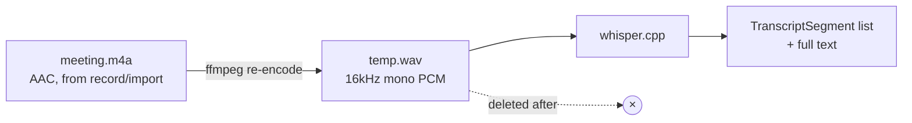
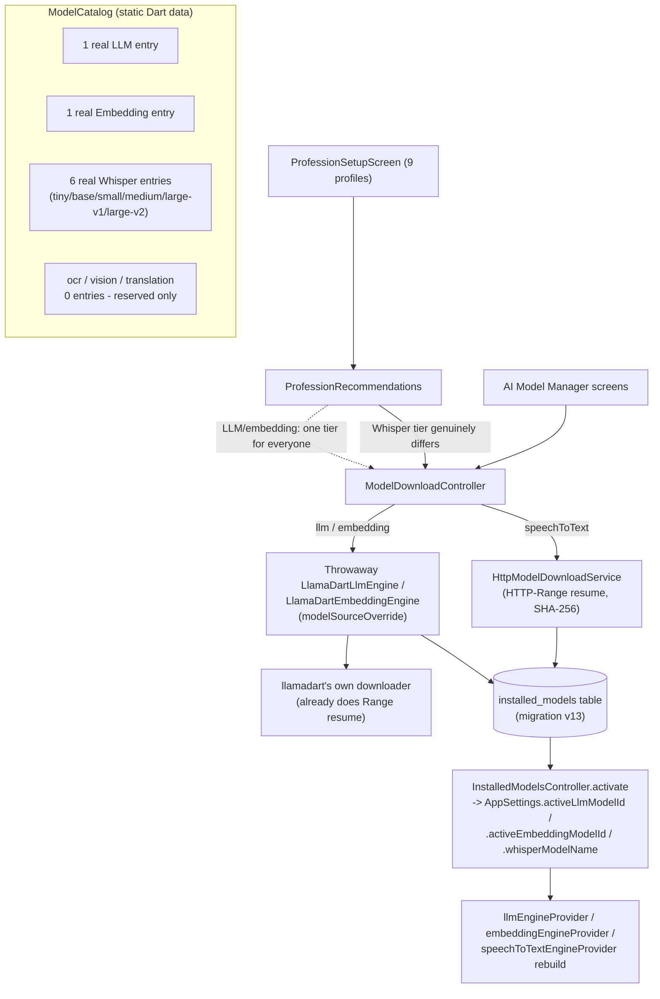
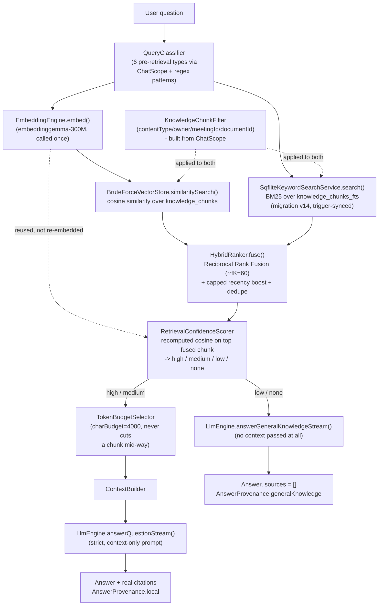

# AI Architecture

> **Sync note (documentation synchronization pass):** this document previously described the V1 meeting-only pipeline plus a since-removed Conversation Translator feature. It has been rewritten from scratch against the current codebase (`lib/services/ai/`, `lib/services/retrieval/`, `lib/features/chat/`, `lib/features/ai_models/`) to describe what actually runs today. For the phase-by-phase history of how it got here, see [`docs/v2/implementation/10-v2-progress.md`](../v2/implementation/10-v2-progress.md) and the ADR log in [`docs/v2/implementation/03-decisions.md`](../v2/implementation/03-decisions.md). Updated again 2026-08-06 for Phase 9.3 (Chat's no-LLM empty state, the confidence-chip relabel, `friendlyErrorMessage()`, and Recommended Setup's real download progress/cancel), tag `phase-9-3`.

Three on-device AI capabilities are wrapped behind abstract interfaces in `lib/services/ai/` — `SpeechToTextEngine`, `LlmEngine`, `EmbeddingEngine` — so a concrete engine can be swapped without touching a use case or a screen. A fourth layer, `lib/services/retrieval/`, sits on top of the LLM and embedding engines and is what actually powers Workspace Chat's answer quality (the Hybrid Retrieval Engine). This document explains what's behind each interface, how they compose, and how failures are bounded.

There is **no Conversation Translator, no text-to-speech service, and no `translate()` method anywhere in this codebase.** An earlier iteration of this app had one; it was fully removed. `ModelKind.translation` still exists as a reserved enum value (see [AI Model Manager](#ai-model-manager) below) with zero catalog entries and no engine behind it — reserved for a possible future feature, not a description of anything currently working.

## Speech-to-text: whisper.cpp

**Package:** [`whisper_flutter_new`](https://pub.dev/packages/whisper_flutter_new) — a Flutter FFI wrapper around [whisper.cpp](https://github.com/ggerganov/whisper.cpp).

**Models:** user-selectable via the AI Model Manager — `tiny` / `base` / `small` / `medium` / `large-v1` / `large-v2`, each an independent, deletable install (`InstalledModelsTable`, migration v13). There is no single hardcoded model tier the way there was before the AI Model Manager existed; a profession-based recommendation (see below) suggests a starting tier, but any of the six can be installed and switched to at any time.

**Audio format constraint.** whisper.cpp's native loader only reads 16kHz mono PCM WAV. The app records and imports audio as AAC (`.m4a`). `WhisperSpeechToTextEngine.transcribe()`:
1. Re-encodes the source `.m4a` into a throwaway 16kHz mono WAV via `ffmpeg_kit_flutter_new`.
2. Runs whisper.cpp against that WAV.
3. Deletes the WAV once whisper is done with it.



**Model acquisition.** Whisper models are downloaded via a purpose-built `HttpModelDownloadService` (HTTP-Range resume, per-chunk stall timeout, local SHA-256 fingerprint, atomic rename only on full success) — not `whisper_flutter_new`'s own downloader, which had no resume/checksum support at all. Cached in the app's support directory; no model ships in the APK.

## The LLM: llama.cpp / Qwen2.5-1.5B-Instruct

**Package:** [`llamadart`](https://pub.dev/packages/llamadart) — routes GGUF models through llama.cpp.

**Model:** `Qwen2.5-1.5B-Instruct`, quantized `Q4_K_M` (~1.1GB). This replaced the project's original `TinyLlama-1.1B-Chat` — meaningfully more capable at following a strict-JSON system prompt. The AI Model Manager's catalog currently offers exactly one real Chat LLM entry — there is no user-selectable multi-tier LLM catalog the way Whisper has (a second tier is an approved future direction, not built — see [`20-future-roadmap.md`](../v2/20-future-roadmap.md)).

**Output format: strict JSON.** The summarization system prompt requires a single JSON object (`summary`, `minutes_of_meeting`, `key_topics`). `LlamaDartLlmEngine._parse()` scans for the first balanced `{...}` via `_extractJsonObject()` before handing it to `jsonDecode`, tolerating a small model's tendency to wrap JSON in ` ```json ` fences or add commentary around it. If no JSON object can be found, or the required `summary` field is missing/empty, the call throws `LlmResponseFormatException`.

### Why decisions and structured action items were dropped

An earlier prompt version asked the model for `decisions` and structured `action_items` alongside the summary. This was removed after real-device testing made generation noticeably slower and the JSON more likely to come back malformed. `LlmSummaryResult.actionItems`/`.decisions` are always empty from `LlamaDartLlmEngine` — the fields stay in the interface only so the shape doesn't need to be reinvented if this is ever reversed. Action items are now purely user-entered. The `decisions` SQLite table, `DecisionRepository`, and the Export screen's decision toggle are left in place as vestigial, never-written-to schema/UI dead weight (see [Database Design](database-design.md#decisions-is-vestigial-not-removed)) — not a functional gap, not worth the churn to tear out.

## The embedding model: embeddinggemma-300M

**Package:** also `llamadart`, via `LlamaDartEmbeddingEngine` (`EmbeddingEngine.embed`/`.embedBatch`). Added in V2 Phase 1B specifically to make retrieval possible — V1 had no embedding model at all. Same on-device, cache-after-first-download pattern as the LLM and Whisper. `LlamaDartEmbeddingEngine` calls `cancelGeneration()` on its own stall timeout, same discipline as the chat engine.

## AI Model Manager

**Screens:** `lib/features/ai_models/presentation/screens/` — `AiModelManagerScreen`, `ModelDetailsScreen`, `ModelStorageScreen`, `ProfessionSetupScreen` (`/settings/ai-models`, `/settings/ai-models/:modelId`, `/settings/ai-models/storage`, `/settings/ai-models/setup`).

Independent download/install/switch/verify/delete per model kind, built on top of the lifecycle machinery below, not a replacement for it:



`InstalledModelRepository`/`InstalledModelsTable` is the source of truth for "is this model installed" (a real DB row, not a file-existence check). `ModelKind` has six values: `llm`, `embedding`, `speechToText`, `ocr`, `vision`, `translation` — the last three have zero catalog entries and no engine; the type is already generic over all six so adding a real engine later is additive, not a refactor.

**Recommended Setup's download UX (Phase 9.3).** `ProfessionSetupScreen`'s "Set up these models" flow shows each model's real name/size/download-percentage/state as it downloads — reusing `ModelDownloadController`'s existing sealed `ModelDownloadState` hierarchy (`Idle`/`InProgress`/`Paused`/`Verifying`/`Failed`/`Done`) rather than adding new states — plus a working Cancel button (`ProfessionSetupController.cancel()`). Before starting, it checks connectivity via a new dependency-free `hasInternetConnection()` (`lib/core/utils/connectivity_check.dart`, `InternetAddress.lookup` with a 5s timeout, no new package) and surfaces a clear explanation rather than a silent hang if there's no connection. `applyRecommendedSetup()` also checks each model's actual `ModelDownloadFailed` state before activating it, throwing a `ModelSetupException` instead of activating a model whose download never completed — a real bug the earlier version had (it could activate on failure).

## The LLM request queue and reliability

Every LLM call goes through `LlmRequestQueue` (`lib/services/ai/llm_request_queue.dart`, `DefaultLlmRequestQueue`), which **serializes** requests — one in flight at a time, every new request waits — rather than rejecting concurrent callers. This matters because the LLM engine is shared across meeting summarization, document summarization, the Workspace Chat pipeline, and the legacy Ask AI use case: a single stuck call from any of them, left unbounded, would block AI functionality app-wide.

Two independent timeouts guard against this, in `lib/services/ai/llamadart_llm_engine.dart`:

1. **Generation stall timeout (`LlmTimeoutException`, 45s).** Every generation call streams its response through a shared `_collect()` helper wrapped in `Stream.timeout(_stallTimeout)` — a *per-event-gap* timeout, not a total-duration cap, so a slow-but-steady generation on a weak device still finishes. On timeout, `engine.cancelGeneration()` is called — a genuine native cancellation — freeing the shared engine for the next queued caller.
2. **Model download timeout (`LlmModelDownloadTimeoutException`, 90s stall / 15min absolute cap).** `llamadart`'s own downloader already retries stalled chunks internally; an outer cancel token additionally bounds the whole download so an extremely slow connection can't hang indefinitely.

Both exception types flow through the existing `AiPipelineFallback`/error-and-retry UI unchanged — as of Phase 9.3, the message actually shown there is passed through `friendlyErrorMessage()` first (see [`hld.md#cross-cutting-concerns`](hld.md#cross-cutting-concerns)), not the exception's raw `toString()`.

`ModelLifecycleManager` (`lib/services/ai/model_lifecycle_manager.dart`) separately owns model **residency**: reference-counted `beginUse`/`endUse` shared uniformly across the LLM, embedding, and Whisper engines, with idle instances unloaded after 5 minutes (`AppConstants.modelIdleUnloadTimeout`) to free memory. It does not own downloading (each engine's own `_ensureLoaded()` does that) or inference.

## Hybrid Retrieval Engine (Workspace Chat's real retrieval pipeline)

This is the single biggest addition since the original AI pipeline: Workspace Chat is backed by a real, fused vector+keyword retrieval pipeline (`lib/services/retrieval/`), not a hand-written keyword scan.



- **Two ranked lists, fused, not chosen between.** Vector similarity search (`BruteForceVectorStore` over `knowledge_chunks`) and BM25 keyword search (`knowledge_chunks_fts`, a separate FTS5 index from the Search screen's `content_fts`) run over the same filtered corpus and are combined with Reciprocal Rank Fusion plus a small capped recency boost — not "try vector, fall back to keyword."
- **Confidence gates which prompt runs.** A real, recomputed cosine-similarity confidence score on the fused top result decides the path: **high/medium** confidence answers strictly from the retrieved, token-budget-selected context with real per-chunk citations (`AnswerProvenance.local`). **Low/none** confidence (including a genuinely empty corpus) answers from the model's own general knowledge instead of a fixed "couldn't find anything" string — `sources` is always empty for this path and `AnswerProvenance.generalKnowledge` is persisted and shown as a distinct banner in the UI. Citations are always built from the chunks retrieval actually returned, never parsed from the model's own text — there is no path that can fabricate a citation.
- **The per-source confidence shown in the UI is the same `ChatSourceRef.confidence` value described above, labeled "N% match" (Phase 9.3).** It is a per-chunk retrieval-relevance score, not a completeness or generation-progress percentage — a real-device report reading it the other way ("Meeting Transcript: 50%") was root-caused to the label, not the number, and fixed by relabeling only; `RetrievalConfidenceScorer`'s thresholds/scoring are unchanged.
- **Every assistant message in Chat carries an always-visible "AI-generated response. Please verify important information." caption (Phase 9.3)**, independent of `AnswerProvenance` — shown for both `local` and `generalKnowledge` answers, not a substitute for the general-knowledge banner above but a baseline disclosure on every answer regardless of provenance.
- **Chat is gated on at least one installed Chat LLM.** `ChatScreen` watches `installedModelsControllerProvider`; if no `ModelKind.llm` model is installed, it renders a dedicated empty state (a "Get Recommended Models" action routing to Profession Setup) instead of a chat surface that would otherwise fail against a missing model (Phase 9.3).
- **`KnowledgeChunkFilter`** is how the same pipeline serves every chat scope (workspace-wide, one meeting, one document) without four separate retrieval implementations.
- **The Search screen's own retrieval is a deliberately separate, untouched system** — `content_fts`/`ContentSearchRepository`, source-item granularity (one row per meeting/document/etc.), no BM25 ranking exposed, no shared code path with the hybrid pipeline above. Unifying them was explicitly scoped out (ADR-037) to avoid an unrelated redesign of an already-working screen.

## Chat: streaming, memory, and cancellation

`WorkspaceChatUseCase` (`lib/features/chat/workspace_chat_use_case.dart`) is what `ChatController`/`ChatScreen` actually calls. It:

- Runs the hybrid pipeline above for every reachable scope (`ChatScope.workspace`, `.meeting`, `.document`).
- Streams the answer token-by-token via `LlmEngine.answerQuestionStream`/`.answerGeneralKnowledgeStream`'s `onToken` callback, layered on `LlmRequestQueue` without changing its single-flight contract.
- Supplies recent conversation history (`_recentHistory()`, capped at 12 messages / ~1500 characters via `_historyMessages()` on the engine side) as `LlmChatTurn`s so a follow-up like "translate that into French" or "what about the second point" is understood in context, rather than met with "what should I translate?"
- Follows a strict cancellation contract (ADR-027): a still-queued request cancels outright through the queue; an already-running one is UI-level "abandoned" — `WorkspaceChatUseCase.call`'s `isAbandoned` callback discards the answer before it is ever persisted to `chat_messages`, not merely hidden after the fact.

**`ChatScope.general` (no retrieval context at all) is not implemented.** `GeneralChatUseCase` (`lib/features/chat/general_chat_use_case.dart`) exists as scaffolding only — its `call()` throws `UnimplementedError`. There is no "General Chat" screen or entry point anywhere in the UI. This is tracked, disclosed backlog (Epic 4, Task 4.2.1.3 in [`docs/v2/implementation/02-backlog.md`](../v2/implementation/02-backlog.md)), not an oversight.

## The legacy Ask AI feature (orphaned, not removed)

`lib/features/ask/ask_about_meetings_use_case.dart` and its screen (`AskScreen`, route `/ask`) still exist and still work, calling `LlmEngine.answerQuestion` directly against meeting content only, with no retrieval pipeline (a simpler keyword-scored context assembly, predating Workspace Chat entirely). **No screen anywhere in the app links to it any more** — it was demoted from Home during the Workspace Chat rollout and never re-linked. It is reachable only by navigating to `/ask` directly. It has not been deleted deliberately (ADR-010's "no-regression-window" rule — Workspace Chat's meeting scope is expected to fully supersede it, but the old path is kept until that's confirmed), not because it's still a recommended way to ask questions about meetings.

## Pipeline orchestration

- **Meetings:** `ProcessNewMeetingUseCase` chains `TranscribeMeetingUseCase` → `GenerateMeetingSummaryUseCase` → `MeetingIndexer` (chunks + embeds the transcript, summary, and each note), run unawaited in the background so the UI never blocks. See [`lld.md`](lld.md) for the sequence diagram.
- **Documents:** `ProcessNewDocumentUseCase` chains `ExtractDocumentTextUseCase` → `SummarizeDocumentUseCase` → `DocumentIndexer`, the same staged-visibility pattern — a document is searchable via FTS5 as soon as extraction finishes, chat-able only once indexing/embedding also finishes.
- Both indexers share `IndexingService`/`ChunkingService` — one chunking/embedding implementation for both content types, not two.

## Resume tailoring: bounded rewrite and generation calls (R-9, R-12)

Every AI touchpoint in the Career/Resume feature is a small, single-purpose `LlmEngine.generateFromPrompt` call submitted through the same `LlmRequestQueue` as every other AI feature in this app (single in-flight generation, ADR-008) — never a second engine, never a long free-running conversation. Each follows the same shape: a pure, stateless prompt-builder class produces `{systemPrompt, userPrompt}` bounded to an explicit, narrow set of facts; the call is wrapped in `try`/`catch` with no retry, degrading to a safe default (never a thrown error, never a fabricated fallback) on any failure.

- **`GenerateResumeSuggestionsUseCase`** (R-9, `lib/features/career/analysis/`) — one bounded bullet-rewrite call per resume entry that already has a `MatchLevel.partial` match against a JD requirement (`ResumeSuggestionPromptBuilder`). Result is persisted as a `pending` `SuggestedEdit`, never auto-applied — `AcceptSuggestedEditUseCase`/`RejectSuggestedEditUseCase` are the only code paths that ever merge AI text into a live block.
- **`GenerateJdTailoredDraftUseCase`** (R-12, `lib/features/career/resume/`) — the AI-Tailored-Resume-from-JD feature's generation step, run once when the user reaches its wizard's Review screen, before any `Resume` row exists:
  - One call for the **professional summary** (`JdTailoredResumeSummaryPromptBuilder`) — grounded strictly in the target role/confirmed skills/education/experience/existing-projects the user already entered in this same wizard, never the JD's raw text. Falls back to a small deterministic sentence (mirrors R-10's `buildBeginnerResumeSummary`) if the model is unavailable or returns nothing usable.
  - Up to 3 calls for **project ideas** (`ProjectIdeaPromptBuilder`) — explicitly framed as ideas, never claims of completed work. A deterministic regex check on the raw output (`built|developed|created|completed|delivered|shipped|launched|implemented|deployed`) discards any idea whose wording leaks completed-tense phrasing, before it's ever shown to the user.
  - **Skill recommendations are deliberately NOT an LLM call at all** — `JdSkillRecommendationService` reuses the existing, purely deterministic `ResumeJdAnalyzer` (see "Hybrid Retrieval Engine" section's sibling, JD analysis is not retrieval-based) to diff the JD's requirements against the user's confirmed skills. This is the single biggest fabrication-risk reduction in the feature: an LLM has no opportunity to assert a skill the user never entered.

### AI recommendation vs. user-confirmed data — the confirmation gate every resume-tailoring feature shares

```
User-confirmed data (typed by the user)
        |
        v
   Resume / ResumeBlock (persisted immediately, as entered)

AI recommendations (skills, project ideas, bullet rewrites)
        |
        v
   Shown to the user, clearly labeled as a suggestion
        |
        v
   Explicit user action required (accept a chip / "Add as Planned Project" /
   accept a SuggestedEdit) - editing the suggested text further is allowed
   and encouraged, not just a yes/no gate
        |
        v
   Resume / ResumeBlock (only now persisted)
```

No AI recommendation in this app has a code path that reaches a persisted `Resume`/block without passing through this gate — `SuggestedEdit`'s `pending` status (R-9) and `JdTailoredResumeInput.confirmedSkills`/`projectEntries` only ever containing what the review screen's local state recorded as accepted (R-12) are the two concrete implementations of the same rule.

### End-to-end flow: AI-Tailored Resume from Job Description (R-12)

```
User
 |
 v
Basic Resume Details (name, education, own skills, own experience/projects)
 |
 v
Job Description (pasted or imported)
 |
 v
JD Parser (JdParser - deterministic, no AI)
 |
 v
JD Analysis (JdSkillRecommendationService -> ResumeJdAnalyzer - deterministic, no AI)
 |
 v
AI Resume Generator (GenerateJdTailoredDraftUseCase - bounded LLM calls: summary, project ideas)
 |
 v
Fabrication / Safety Validation (completed-tense rejection regex; recommendations start unaccepted)
 |
 v
User Review (confirm/reject skills, edit summary, confirm/edit-and-add project ideas)
 |
 v
Resume Model (CreateJdTailoredResumeUseCase - normal Resume + ResumeBlockRef rows)
 |
 v
Template Renderer (existing ResumeCompilerService + ResumeTemplateRenderer, unmodified)
 |
 v
PDF Export (existing export pipeline, unmodified)
```
