# Database Design

> **Sync note (documentation synchronization pass):** rewritten against the current schema (`lib/database/tables.dart` + `lib/database/migrations/v1.dart`–`v15.dart`). The prior version of this document described the V1 schema (7 tables, migrations v1–v3) and a Conversation Translator feature that has since been removed. [`../sql/schema.sql`](../sql/schema.sql) has been regenerated alongside this document to match. Updated again 2026-08-06 for migration v15 (`folders`, `documents.folder_id`) — see Phase 9.3 in [`10-v2-progress.md`](../v2/implementation/10-v2-progress.md), tag `phase-9-3`.

## Storage choice: SQLite (relational) + Hive (key-value)

Fifteen tables have real relational structure and are queried with filters, so they live in **SQLite** via `sqflite`/`sqflite_common_ffi`, with hand-written SQL rather than an ORM.

**Settings** remain a single row of key-value preferences (theme mode, transcription language, active model ids, etc.) in **Hive** — no relational structure, no query/filter needs.

**There is no in-memory-only, never-persisted content type in this app any more.** An earlier iteration (the Conversation Translator) deliberately never touched disk; that feature has been removed entirely, and nothing has replaced it in that role. Every content type below is a real, persisted SQLite row.

## Migration history (v1 → v15)

| Version | Adds | Why |
|---|---|---|
| v1 | `meetings`, `transcripts`, `summaries`, `action_items`, `decisions`, `recording_marks`, `notes` | Original V1 schema |
| v2 | `meetings.error_message` | Failed pipeline stage needs a diagnosable message, not just "something went wrong" |
| v3 | `recording_marks`, `notes`, `meetings.is_favorite` | (already counted in v1's table list above — this is the historical V1 migration that introduced them) |
| v4 | `content_fts` (FTS5) + triggers on meetings/transcripts/summaries/action_items/notes | Full-text search infrastructure, replacing `LIKE`-scan search |
| v5 | `documents` table | V2 Phase 1A — documents become a first-class content type |
| v6 | `summaries` rebuilt (nullable `meeting_id`, new `document_id`, CHECK exactly-one), `content_fts` rebuilt with `document_id` | Documents become first-class in the shared summary table and search index |
| v7 | `knowledge_chunks` | V2 Phase 1B — retrieval infrastructure begins (embeddings) |
| v8 | `knowledge_chunks` rebuilt with `content_type` + `source_id` | A meeting owns multiple independently-changing prose sources (transcript, summary, each note); re-indexing one must not delete another's chunks |
| v9 | `chat_sessions`, `chat_messages` | V2 Phase 2A — Workspace Chat |
| v10 | `chat_sessions.is_pinned` | V2 Phase 2B — pin a conversation |
| v11 | `toolkit_files` | V2 Phase 5A — Student Toolkit (Image Tools) |
| v12 | `toolkit_files.page_count` | V2 Phase 5B — Scanner + PDF Tools outputs have a page count |
| v13 | `installed_models` | V2 Phase 6A — AI Model Manager |
| v14 | `knowledge_chunks_fts` (FTS5), `chat_messages.answer_provenance` | V2 Phase 6B — Hybrid Retrieval Engine |
| v15 | `folders`, `documents.folder_id` | V2 Phase 9.3 — lightweight document folder organization |

A fresh install runs all fifteen migrations in sequence (`AppDatabase.open`), so it never ends up on an intermediate schema.

## ER diagram

```mermaid
erDiagram
    MEETINGS ||--o| TRANSCRIPTS : has
    MEETINGS ||--o{ SUMMARIES : has
    MEETINGS ||--o{ ACTION_ITEMS : has
    MEETINGS ||--o{ DECISIONS : "has (vestigial, see notes)"
    MEETINGS ||--o{ RECORDING_MARKS : has
    MEETINGS ||--o{ NOTES : has
    MEETINGS ||--o{ KNOWLEDGE_CHUNKS : indexes
    MEETINGS ||--o{ CHAT_SESSIONS : "scoped to"
    DOCUMENTS ||--o{ SUMMARIES : has
    DOCUMENTS ||--o{ KNOWLEDGE_CHUNKS : indexes
    DOCUMENTS ||--o{ CHAT_SESSIONS : "scoped to"
    CHAT_SESSIONS ||--o{ CHAT_MESSAGES : contains
    FOLDERS |o--o{ DOCUMENTS : "organizes (v15, no enforced FK)"

    MEETINGS {
        integer id PK
        text title
        text source "recorded | imported"
        text status "created|downloadingModel|transcribing|downloadingSummaryModel|summarizing|indexing|ready|error"
        text created_at
        text updated_at
        integer duration_seconds
        text audio_file_path
        text error_message "v2: set when status = error"
        integer is_favorite "History Favorites filter"
    }
    TRANSCRIPTS {
        integer id PK
        integer meeting_id FK
        text language
        text full_text
        text segments_json
        text created_at
    }
    SUMMARIES {
        integer id PK
        integer meeting_id FK "nullable, v6"
        integer document_id FK "nullable, v6; CHECK: exactly one of the two set"
        text summary_text
        text minutes_of_meeting
        text key_topics_json
        text model_used
        text generated_at
    }
    ACTION_ITEMS {
        integer id PK
        integer meeting_id FK
        text description "user-entered, not AI-extracted"
        text owner
        text due_date
        integer is_completed
        text created_at
    }
    DECISIONS {
        integer id PK
        integer meeting_id FK
        text description "never written to since the AI stopped extracting decisions"
        text created_at
    }
    RECORDING_MARKS {
        integer id PK
        integer meeting_id FK
        integer offset_ms
        text created_at
    }
    NOTES {
        integer id PK
        integer meeting_id FK
        text content
        text created_at
        text updated_at
    }
    DOCUMENTS {
        integer id PK
        text title
        text original_filename
        text source_type
        text mime_type
        integer file_size_bytes
        text file_path
        text status "created|extracting|indexing|summarizing|ready|error"
        text extracted_text
        text error_message
        text created_at
        text updated_at
        integer folder_id "nullable, v15; not a DB foreign key, see design notes"
    }
    FOLDERS {
        integer id PK
        text title
        text created_at
        text updated_at
    }
    KNOWLEDGE_CHUNKS {
        integer id PK
        integer meeting_id FK "nullable; CHECK: exactly one of meeting/document set"
        integer document_id FK "nullable"
        text content_type "v8: document|transcript|summary|note"
        integer source_id "v8: the source row's own PK, not the owning meeting/document id"
        integer chunk_index
        text chunk_text
        blob embedding "little-endian float64, v7"
        integer embedding_dim
        text created_at
    }
    CHAT_SESSIONS {
        integer id PK
        text title
        text scope "general|workspace|document|meeting"
        integer meeting_id FK "nullable; CHECK tied to scope"
        integer document_id FK "nullable; CHECK tied to scope"
        text created_at
        text updated_at
        integer is_pinned "v10"
    }
    CHAT_MESSAGES {
        integer id PK
        integer session_id FK
        text role "user|assistant"
        text content
        text sources_json "citations, always from retrieved chunks, never parsed from model text"
        text created_at
        text answer_provenance "v14: local|general_knowledge, null for user rows"
    }
    TOOLKIT_FILES {
        integer id PK
        text tool_type "imageCompress|imageResize|scan|pdfCompress|pdfMerge|pdfSplit|pdfOrganize"
        text title
        text output_path
        integer file_size_bytes
        integer original_file_size_bytes "nullable"
        integer is_favorite
        text created_at
        text updated_at
        integer page_count "nullable, v12"
    }
    INSTALLED_MODELS {
        integer id PK
        text model_id "references ModelCatalog, not a DB foreign key"
        text kind "llm|embedding|speechToText|ocr|vision|translation"
        text local_path
        integer size_bytes
        text downloaded_at
        text local_sha256 "nullable"
        integer is_active "at most one per kind, enforced at repository layer"
    }
```



**Two FTS5 virtual tables exist, not shown as entities above** (SQLite FTS5 doesn't support real foreign keys, so an ER diagram would misrepresent them as enforced relationships):
- **`content_fts`** (v4, extended v6) — source-item granularity (one row per meeting/document/transcript/summary/action item/note), trigger-synced, powers the **Search screen** only, via `ContentSearchRepository`. No BM25 ranking exposed — a plain `MATCH` query, deduped by id.
- **`knowledge_chunks_fts`** (v14) — chunk granularity, an "external content" table over `knowledge_chunks.chunk_text` (`content=knowledge_chunks, content_rowid=id`, so the text is never duplicated on disk), trigger-synced, powers the **keyword half of Hybrid Retrieval for Chat** only, via `SqfliteKeywordSearchService`. Deliberately a second, separate index rather than extending `content_fts` — different consumer, different granularity, no shared code path (ADR-037).

## Design notes

- **Polymorphic ownership pattern (ADR-005).** `summaries`, `knowledge_chunks`, and `chat_sessions` all use the same shape — two nullable foreign keys (one to `meetings`, one to `documents`) with a `CHECK` constraint enforcing exactly one is set — rather than a separate `document_summaries`-style table or an unenforced `(owner_type, owner_id)` pair. `chat_sessions` extends this to a three-way discriminated shape (`scope` also allows `general`/`workspace`, setting neither FK), since a chat session, unlike a summary or knowledge chunk, can legitimately belong to no single owner at all.
- **`decisions` is vestigial, not removed.** The AI stopped extracting decisions (see [`ai-architecture.md`](ai-architecture.md#why-decisions-and-structured-action-items-were-dropped)) and there is no manual "add decision" UI. The table was never dropped because the Export screen's per-section toggle and the search use case still reference `DecisionRepository` — both remain correct, just permanently no-ops.
- **`content_type` + `source_id` on `knowledge_chunks` (v8).** A meeting owns several independently-changing prose sources under one `meeting_id` (its transcript, its summary, each of its notes) — re-indexing one (e.g. an edited note) must delete and reinsert only that source's chunks, never another's. `source_id` is always the source row's own primary key, never the owning meeting/document's id; `content_type` disambiguates which source table it came from. Mirrors `content_fts`'s already-proven `content_type`/`source_id` design exactly.
- **Cascading deletes.** Every foreign key is declared `ON DELETE CASCADE`, and `PRAGMA foreign_keys = ON` is set on every connection. Deleting a `meetings` or `documents` row automatically removes every dependent row across transcripts/summaries/action items/decisions/recording marks/notes/knowledge chunks/chat sessions (and, transitively, chat messages). `DeleteMeetingUseCase`/`DeleteDocumentUseCase` additionally call `VectorStore.invalidateCache()` after deleting, since the vector store keeps an in-memory cache that cascading alone doesn't invalidate.
- **`toolkit_files` has no foreign keys at all.** Student Toolkit outputs (image compress/resize, scans, PDF tools) are a standalone content type, not owned by any meeting/document/chat entity, and deliberately have no FTS5 entry — toolkit outputs aren't part of the workspace's searchable knowledge.
- **`installed_models` has no foreign keys either.** It's device configuration (which model files are actually on disk, and which is active per kind), not user content. `model_id` references `ModelCatalog`, a static Dart data structure, not a database table — so this is a validated-in-code string reference, not an enforced FK, the same convention `toolkit_files.tool_type` uses for `ToolkitToolType`.
- **`documents.folder_id` (v15) is deliberately not a foreign key either**, for the same reason as the two bullets above — validated at the repository layer (`FolderRepository`/`DocumentRepository`) rather than the schema layer. `folders` itself is a small, standalone table (`id`/`title`/`created_at`/`updated_at`) with no children of its own; deleting a folder (`FolderRepository.delete()`) sets every member document's `folder_id` back to `NULL` before removing the folder row — a folder is an organizational label, never a container whose deletion cascades to content. `Document`'s own `@freezed` model was deliberately left unchanged (no `folderId` field added to it); folder membership is read/written only through dedicated repository methods (`getInFolder`, `moveToFolder`, `getFolderId`), avoiding a `build_runner` codegen run for what is otherwise a narrow, additive feature.
- **`segments_json` / `key_topics_json`.** Transcript segments and key topics are stored as JSON text rather than normalized child tables, since they're always read/written as a whole with their parent row and never queried independently.
- **Timestamps as ISO-8601 text**, not Unix integers — directly `DateTime.parse`-able and human-readable when inspecting the DB file directly.
- **Indexes** on every foreign key and on `knowledge_chunks(content_type, source_id)` for the v8 scoped-reindex lookup.
- **The embedding column is a BLOB**, not a separate vector-engine table — `sqlite-vec` was evaluated and found incompatible with `package:sqflite` (ADR-004); a brute-force in-memory cosine-similarity scan (`BruteForceVectorStore`) reads the BLOB column directly. This is a deliberate, disclosed trade-off, not an oversight — see [`ai-architecture.md`](ai-architecture.md#hybrid-retrieval-engine-workspace-chats-real-retrieval-pipeline).

## Folder structure (why it looks the way it does)

```
lib/
  core/            # theming, routing, constants, cross-cutting utils
  shared/          # reusable widgets used by 2+ features (EmptyState, AppShell, KnowledgeSourceCard, ...)
  models/          # entities shared across features (Meeting, Document, ChatSession, KnowledgeChunk, Folder, ...)
  database/        # sqflite bootstrap + versioned migrations (v1-v15) + table/column constants
  repositories/    # abstract repository interfaces + sqflite implementations
  services/
    audio/         # RecorderService, AudioImportService (record, file_picker, ffmpeg)
    ai/            # SpeechToTextEngine, LlmEngine, EmbeddingEngine, ModelLifecycleManager, LlmRequestQueue
    retrieval/     # ChunkingService, VectorStore, KeywordSearchService, HybridRanker, RetrievalConfidenceScorer, ...
    documents/     # PDF/DOCX/TXT/Markdown text extraction
    toolkit/       # image/PDF/scan processing (pure Dart + pdf/printing packages)
    security/      # AppLockService (local_auth)
    export/        # PdfExportService
    background/    # background download continuation
  providers/       # composition root: wires concrete impls behind interfaces (Riverpod, ~60 providers, one file)
  features/
    <name>/
      presentation/
        screens/    # Views
        widgets/    # feature-local reusable widgets
        providers/  # ViewModels (Riverpod Notifiers) + screen-scoped FutureProviders
      <name>_use_case.dart   # only where real multi-step orchestration exists
```

Current top-level features: `ai_models`, `ai_summary`, `ask` (legacy, orphaned — see [`ai-architecture.md`](ai-architecture.md#the-legacy-ask-ai-feature-orphaned-not-removed)), `chat`, `documents`, `export`, `import`, `meetings`, `onboarding`, `recording`, `search`, `settings`, `student_toolkit`, `transcription`. There is no `conversation_translator/` or `tts/` folder — both were fully removed, not merely hidden.

See [`../sql/schema.sql`](../sql/schema.sql) for the exact `CREATE TABLE`/`CREATE VIRTUAL TABLE`/trigger statements, generated from and kept in sync with `lib/database/migrations/v1.dart` through `v15.dart`.
