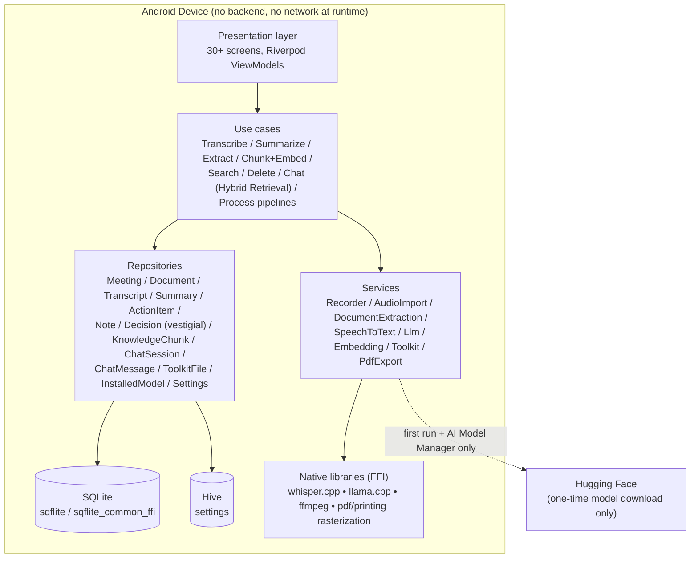
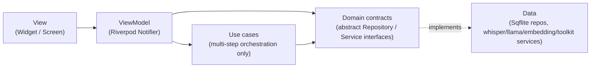
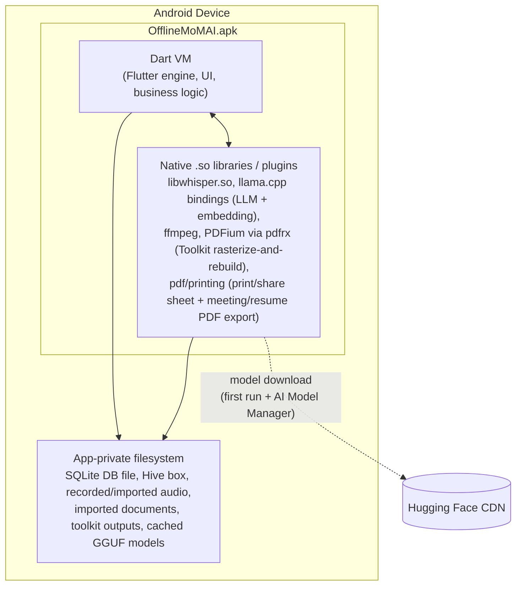
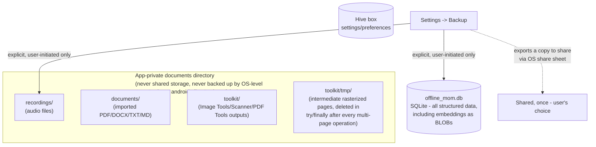

# High-Level Design (HLD)

> **Sync note (documentation synchronization pass):** rewritten against the current codebase. The prior version described a meeting-only V1 product with a Conversation Translator feature; both the product scope and that feature description are gone. See [`docs/v2/README.md`](../v2/README.md) for the full V1 → V2 evolution narrative and [`docs/v2/implementation/12-architecture-diagrams.md`](../v2/implementation/12-architecture-diagrams.md) for a more granular diagram set this document draws from.

## System overview

OfflineMoMAI is a single Android app with no backend. It is a private, offline AI workspace: meetings are one content type among several — meetings, imported documents, a chat interface over both, and a Student Toolkit for everyday file utilities (image/PDF tools, scanning). Everything — audio capture, document parsing, storage, speech-to-text, embeddings, and LLM inference — runs inside the app process (or an isolate it spawns) on-device.

The dotted line to Hugging Face is the **only** network-capable path in the app: it fires once per model (whichever LLM/embedding/Whisper tier is installed, plus any later switch made through the AI Model Manager), caching the file on-device afterward, bounded by hard timeouts so a bad connection can't hang it indefinitely. See [`ai-architecture.md`](ai-architecture.md).

There is no longer any in-memory-only, never-persisted content type in this app — an earlier iteration's Conversation Translator was the one exception to "everything is a real, persisted row," and it has been removed entirely.

## Layered architecture

The codebase follows **Clean Architecture** adapted for Flutter, with **MVVM** inside the presentation layer, wired together with **Riverpod** for dependency injection — unchanged in shape since V1, now with more features hanging off the same layering:

**Dependency rule:** arrows only point toward the domain contracts. A ViewModel never imports a concrete `Sqflite*Repository` or a plugin package directly — it depends on the abstract interface, and Riverpod's composition root (`lib/providers/app_providers.dart`, ~60 provider declarations in one file) is the only place concrete implementations get wired in. This is what let the LLM engine be swapped (`flutter_llama` → `llamadart`, V1) and the AI Model Manager add a whole new selectable-model dimension without touching a single screen's business logic.

Use cases exist only where there's real multi-step orchestration crossing more than one repository/service (e.g. `ProcessNewMeetingUseCase`, `ProcessNewDocumentUseCase`, `WorkspaceChatUseCase`, `SearchWorkspaceUseCase`, `DeleteMeetingUseCase`). Simple CRUD is called directly from a ViewModel against the repository interface.

## Component diagram

```mermaid
graph TB
    subgraph Presentation
        Home[Home screen]
        HistorySearch[History / Search screens]
        Record[Record/Recording screens]
        Import[Import screen]
        MeetingDet[Meeting Details<br/>Transcript/Summary/MoM/ActionItems/Notes tabs]
        DocScreens[Documents / Document Import / Document Details]
        ChatScreens[Chat / Chat History screens]
        Toolkit[Student Toolkit screens<br/>Image Tools/Scanner/PDF Tools/Recent Files]
        Export[PDF Preview/Export screens]
        Settings[Settings/About/Privacy/Help/Appearance/<br/>AI Models/Storage/Recording/Language/Backup]
        AskLegacy["Ask AI screen<br/>(orphaned - no nav entry)"]
    end

    subgraph UseCases["Use Cases"]
        ProcessMeeting[ProcessNewMeetingUseCase]
        ProcessDoc[ProcessNewDocumentUseCase]
        Transcribe[TranscribeMeetingUseCase]
        Summarize[GenerateMeetingSummaryUseCase]
        SummarizeDoc[SummarizeDocumentUseCase]
        ExtractDoc[ExtractDocumentTextUseCase]
        Search[SearchWorkspaceUseCase]
        DeleteMeeting[DeleteMeetingUseCase]
        DeleteDoc[DeleteDocumentUseCase]
        WorkspaceChat[WorkspaceChatUseCase]
        AskUC["AskAboutMeetingsUseCase (legacy)"]
    end

    subgraph Repositories
        MeetingRepo[MeetingRepository]
        DocRepo[DocumentRepository]
        FolderRepo["FolderRepository (v15)"]
        TranscriptRepo[TranscriptRepository]
        SummaryRepo[SummaryRepository]
        ChunkRepo[KnowledgeChunkRepository]
        ChatSessionRepo[ChatSessionRepository]
        ChatMessageRepo[ChatMessageRepository]
        ToolkitRepo[ToolkitFileRepository]
        InstalledModelRepo[InstalledModelRepository]
        SettingsRepo[SettingsRepository]
    end

    subgraph Services
        RecorderSvc[RecorderService]
        ExtractSvc[DocumentTextExtractionService]
        SttSvc[SpeechToTextEngine]
        LlmSvc["LlmEngine (shared: summary + chat + legacy Ask)"]
        EmbedSvc[EmbeddingEngine]
        RetrievalSvc["Retrieval pipeline<br/>(VectorStore, KeywordSearchService, HybridRanker)"]
        ToolkitSvc[Toolkit services<br/>image/PDF/scan]
        PdfSvc[PdfExportService]
    end

    Home --> MeetingRepo
    Home --> DocRepo
    Home --> ChatSessionRepo
    Record --> RecorderSvc
    Record --> ProcessMeeting
    Import --> ProcessMeeting
    DocScreens --> ProcessDoc
    DocScreens --> FolderRepo
    MeetingDet --> TranscriptRepo
    MeetingDet --> SummaryRepo
    ChatScreens --> WorkspaceChat
    ChatScreens --> ChatSessionRepo
    Toolkit --> ToolkitSvc
    Toolkit --> ToolkitRepo
    Export --> PdfSvc
    Settings --> SettingsRepo
    Settings --> InstalledModelRepo
    AskLegacy --> AskUC

    ProcessMeeting --> Transcribe --> SttSvc
    ProcessMeeting --> Summarize --> LlmSvc
    ProcessMeeting --> RetrievalSvc
    ProcessDoc --> ExtractDoc --> ExtractSvc
    ProcessDoc --> SummarizeDoc --> LlmSvc
    ProcessDoc --> RetrievalSvc
    RetrievalSvc --> EmbedSvc
    RetrievalSvc --> ChunkRepo
    WorkspaceChat --> RetrievalSvc
    WorkspaceChat --> LlmSvc
    WorkspaceChat --> ChatMessageRepo
    AskUC --> LlmSvc
    AskUC --> MeetingRepo
    Search --> MeetingRepo
    Search --> DocRepo
    DeleteMeeting --> MeetingRepo
    DeleteDoc --> DocRepo
```

## Deployment diagram

There is exactly one deployable artifact: the Android APK. No servers.

There is no Android TextToSpeech system-service integration any more — the one feature that used it (Conversation Translator) has been removed.

## Storage architecture

Backup/export is the *only* path any of this data ever leaves the app's private storage, and it is always an explicit user action (Settings → Backup → Share), never automatic. `android:allowBackup="false"` additionally blocks the OS's own automatic backup mechanisms from doing this implicitly. `toolkit/tmp/` is the one place in the app that ever holds an intermediate file mid-operation (multi-page PDF/scan work can't stay fully in memory); a `clearToolkitTempFiles()` safety net cleans up anything a crash left behind.

## Productivity Toolkit PDF rendering backend (PDFium)

Every rasterize-and-rebuild PDF Tool (Compress/Merge/Split/Organize/Redact/Edit, ADR-034) reads existing PDF pages through one shared choke point, `PdfPageRenderingService` (`lib/services/toolkit/pdf_page_rendering_service.dart`), wired in `lib/providers/app_providers.dart`'s `pdfPageRenderingServiceProvider`. Its implementation changed from `PrintingPdfPageRenderingService` (wrapping `package:printing`'s `Printing.raster()`, which rasterizes via `android.graphics.pdf.PdfRenderer` on Android - the OS's own bundled PDF renderer) to `PdfiumPdfPageRenderingService` (wrapping `package:pdfrx`'s bundled PDFium engine - the same rendering core Chrome uses, MIT-licensed, fully on-device).

**Why:** a real, verified bug - merging a resume PDF with embedded/subsetted TrueType fonts produced a near-blank output page (most text missing, a bullet-point character rendering as a visible "missing glyph" box). Root-caused by extracting the produced page's embedded image directly and comparing it against the same source PDF rendered by a spec-compliant reference engine, which rendered it correctly - proving the defect was introduced by this app's own rasterization step, not present in the source PDF. Android's built-in `PdfRenderer` has known gaps rendering certain embedded/subsetted font encodings; `pdfx` (a candidate alternative) was evaluated and rejected after reading its own Android source, which wraps the *same* `android.graphics.pdf.PdfRenderer` API under a different Dart surface - it would not have fixed this.

Two related fixes landed alongside the renderer swap, both in the shared path so every Toolkit tool benefits, not just the one that surfaced the bug:
- **`encodeRasterAsJpeg`** (same file) now accepts either RGBA8888 (the old renderer's format) or BGRA8888 (PDFium's) via a `RasterChannelOrder` parameter, reusing its existing alpha-compositing fix (R-6) for both rather than duplicating it.
- **`pdf_overlay.dart`'s invisible search-text layer** (`PdfSearchableTextPreserver`, release blocker B3/R-49) now accepts an optional Unicode-fallback font list (`textFontFallback`) for `pw.Text`'s built-in `TextStyle.fontFallback` mechanism. Root cause: a character the base Helvetica font can't represent (e.g. `●` U+25CF, `→` U+2192 - both real characters from the same resume) makes `package:pdf` draw its own "missing glyph" placeholder box, a *different* drawing primitive from a text glyph that bypasses the invisible render-mode (`Tr 3`) check entirely - confirmed by reading `package:pdf`'s own `widgets/text.dart`. `PdfMergeService` is the one caller that currently supplies a fallback (this app's already-bundled `assets/fonts/Inter-Regular.ttf`, loaded once via `overlayTextFallbackFontProvider`); every other overlay caller (Add Text, Signatures, Watermark) is unaffected since the parameter defaults to empty.
- **`looksLikeBlankRenderFailure`** (`pdf_page_rendering_service.dart`) is a defensive backstop, not the primary fix: `PdfMergeService` cross-references it against that same page's extracted text (via `PdfSearchableTextPreserver`) and throws a clear, user-facing error instead of silently producing a broken merged PDF if a *future* rasterizer regression on some other document produces a near-blank page for a source page that genuinely had text. A page with no extracted text (a real blank/scanned/image-only page) is never flagged - there is no independent signal it should have looked any different.

## Cross-cutting concerns

- **Error handling:** every pipeline stage (transcribe, summarize, extract, index) catches its own failures and records `status = error` on the meeting/document row rather than crashing the app; screens render a dedicated failure empty-state (`lib/shared/widgets/ai_pipeline_fallback.dart`). Whatever text reaches the user (that widget, Chat, the meeting transcript error tab, AI model download/setup) is passed through `friendlyErrorMessage()` (`lib/core/utils/friendly_error.dart`, Phase 9.3) first — a raw exception's `toString()`/stack trace is never shown directly; the underlying error is still logged via `AppLogger`, only the on-screen text is translated.
- **Bounded AI latency:** no LLM call, embedding call, or model download can hang indefinitely — see [`ai-architecture.md#the-llm-request-queue-and-reliability`](ai-architecture.md#the-llm-request-queue-and-reliability). This applies app-wide since the LLM engine is shared across meeting/document summarization, Workspace Chat, and the legacy Ask AI use case.
- **Resource safety:** every native engine/recorder holds OS resources (mic, native memory) and is disposed via Riverpod's `ref.onDispose`; `ModelLifecycleManager` additionally idle-unloads AI engines after 5 minutes of no use.
- **State**: sealed classes (`RecordingUiState`, `ImportUiState`, `DocumentImportUiState`, chat/toolkit controller states) model each ViewModel's state exhaustively rather than using loose booleans.
- **Privacy:** every content type is local-only SQLite/Hive storage, never transmitted. The one network edge (model download) is disclosed and bounded; nothing else in the app makes a network call.
- **Re-entry guards:** controllers that kick off an async operation from a tappable button (`ImportController`, `DocumentImportController`, `RecordingController`, `ModelDownloadController`, `ChatController`) set their in-flight state synchronously as the first statement of the method, before any `await` — closing the timing window a UI-level "disable the button" alone can't fully close.

See [`lld.md`](lld.md) for class-level detail and sequence diagrams, [`ai-architecture.md`](ai-architecture.md) for the AI pipeline, [`database-design.md`](database-design.md) for the schema, and [`navigation-flow.md`](navigation-flow.md) for the route map.
