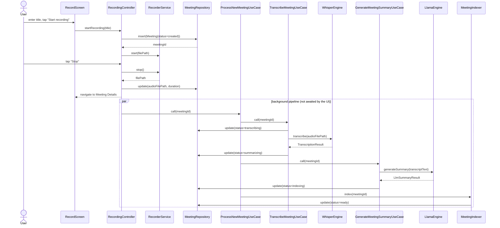
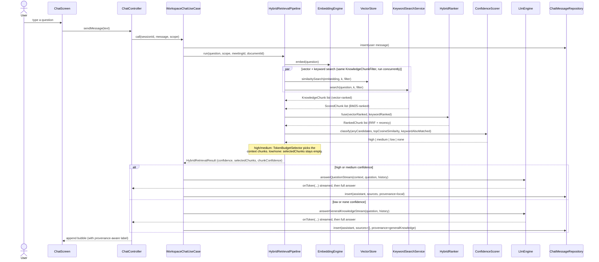
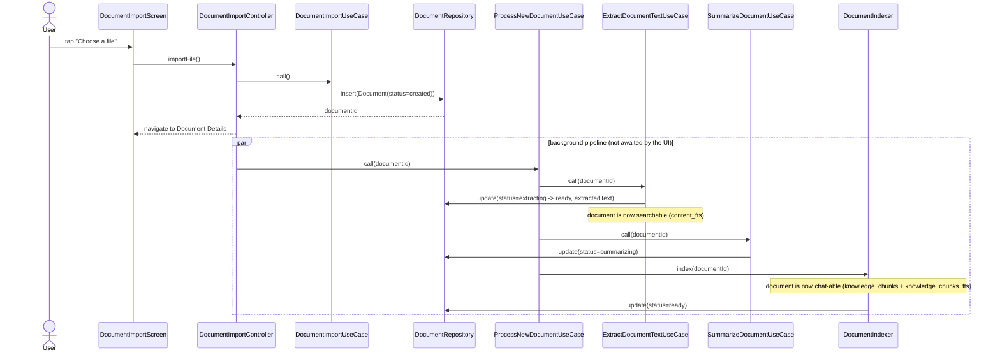
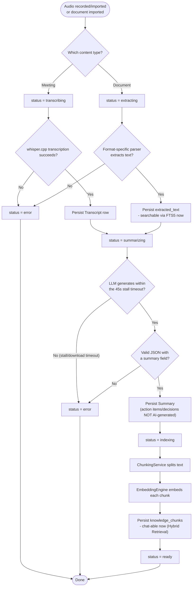

# Low-Level Design (LLD)

> **Sync note (documentation synchronization pass):** rewritten against the current codebase. The prior version's class diagram and sequence diagrams centered on a meeting-only pipeline plus a Conversation Translator feature that has since been removed; both are gone from this document, replaced with the current Document/Chat/Hybrid-Retrieval shapes. Updated again 2026-08-06 for `FolderRepository`/`Folder` (Phase 9.3, migration v15, tag `phase-9-3`).

## Class diagram — core domain & data flow

```mermaid
classDiagram
    class Meeting {
        +int? id
        +String title
        +MeetingSource source
        +MeetingStatus status
        +DateTime createdAt
        +DateTime updatedAt
        +int durationSeconds
        +String? audioFilePath
        +bool isFavorite
        +copyWith()
    }
    class MeetingStatus {
        <<enumeration>>
        created
        downloadingModel
        transcribing
        downloadingSummaryModel
        summarizing
        indexing
        ready
        error
    }
    class Document {
        +int? id
        +String title
        +String originalFilename
        +DocumentSourceType sourceType
        +String mimeType
        +int fileSizeBytes
        +String filePath
        +DocumentStatus status
        +String? extractedText
        +String? errorMessage
        +copyWith()
    }
    class DocumentStatus {
        <<enumeration>>
        created
        extracting
        downloadingSummaryModel
        summarizing
        indexing
        ready
        error
    }
    class Summary {
        +int? id
        +int? meetingId
        +int? documentId
        +String summaryText
        +String minutesOfMeeting
        +List~String~ keyTopics
        +String modelUsed
        +DateTime generatedAt
    }
    class ActionItem {
        +int? id
        +int meetingId
        +String description
        +String? owner
        +DateTime? dueDate
        +bool isCompleted
    }
    class Decision {
        <<vestigial - AI no longer writes these, see ai-architecture.md>>
        +int? id
        +int meetingId
        +String description
    }
    class KnowledgeChunk {
        +int? id
        +ContentType contentType
        +int sourceId
        +int? meetingId
        +int? documentId
        +int chunkIndex
        +String chunkText
        +Float64List embedding
        +DateTime createdAt
    }
    class ChatSession {
        +int? id
        +String title
        +ChatScope scope
        +int? meetingId
        +int? documentId
        +bool isPinned
        +DateTime createdAt
        +DateTime updatedAt
    }
    class ChatScope {
        <<enumeration>>
        general
        workspace
        document
        meeting
    }
    class ChatMessage {
        +int? id
        +int sessionId
        +ChatMessageRole role
        +String content
        +String? sourcesJson
        +AnswerProvenance? answerProvenance
        +DateTime createdAt
    }
    class AnswerProvenance {
        <<enumeration>>
        local
        generalKnowledge
    }

    Meeting "1" --> "0..1" Summary
    Document "1" --> "0..1" Summary
    Meeting "1" --> "0..*" ActionItem
    Meeting "1" --> "0..*" Decision
    Meeting "1" --> "0..*" KnowledgeChunk
    Document "1" --> "0..*" KnowledgeChunk
    Meeting "1" --> "0..*" ChatSession
    Document "1" --> "0..*" ChatSession
    ChatSession "1" --> "0..*" ChatMessage

    class MeetingRepository {
        <<interface>>
        +insert(Meeting) Future~int~
        +update(Meeting) Future~void~
        +delete(int) Future~void~
        +getById(int) Future~Meeting?~
        +getAll() Future~List~Meeting~~
    }
    class DocumentRepository {
        <<interface>>
        +insert(Document) Future~int~
        +update(Document) Future~void~
        +delete(int) Future~void~
        +getById(int) Future~Document?~
        +getAll() Future~List~Document~~
        +getInFolder(int? folderId) Future~List~Document~~
        +moveToFolder(int documentId, int? folderId) Future~void~
        +getFolderId(int documentId) Future~int?~
    }
    class FolderRepository {
        <<interface>>
        +insert(Folder) Future~int~
        +update(Folder) Future~void~
        +delete(int) Future~void~
        +getById(int) Future~Folder?~
        +getAll() Future~List~Folder~~
    }
    note for FolderRepository "v15/Phase 9.3. Folder.id is not a DB foreign key on documents.folder_id - validated at this repository layer, per the toolkit_files.tool_type / installed_models.model_id convention. delete() clears folder_id on member documents first; it never deletes a document."
    class Folder {
        +int? id
        +String title
        +DateTime createdAt
        +DateTime updatedAt
    }
    FolderRepository ..> Folder
    Document "0..*" --> "0..1" Folder : folder_id (unenforced)
    class KnowledgeChunkRepository {
        <<interface>>
        +insert(KnowledgeChunk) Future~int~
        +insertAll(List~KnowledgeChunk~) Future~void~
        +deleteForSource(contentType, sourceId) Future~void~
        +getForMeeting(int) Future~List~KnowledgeChunk~~
        +getForDocument(int) Future~List~KnowledgeChunk~~
        +getAll() Future~List~KnowledgeChunk~~
    }
    class ChatSessionRepository {
        <<interface>>
        +insert(ChatSession) Future~int~
        +update(ChatSession) Future~void~
        +getById(int) Future~ChatSession?~
        +getAll() Future~List~ChatSession~~
    }
    class ChatMessageRepository {
        <<interface>>
        +insert(ChatMessage) Future~int~
        +getForSession(int) Future~List~ChatMessage~~
        +deleteMessage(int) Future~void~
        +deleteFromMessageOnward(sessionId, messageId) Future~void~
    }

    class SpeechToTextEngine {
        <<interface>>
        +transcribe(String path) Future~TranscriptionResult~
    }
    class WhisperSpeechToTextEngine
    SpeechToTextEngine <|.. WhisperSpeechToTextEngine

    class EmbeddingEngine {
        <<interface>>
        +embed(String text) Future~Float64List~
        +embedBatch(List~String~ texts) Future~List~Float64List~~
    }
    class LlamaDartEmbeddingEngine
    EmbeddingEngine <|.. LlamaDartEmbeddingEngine

    class LlmEngine {
        <<interface>>
        +generateSummary(String text, onPreparingModel) Future~LlmSummaryResult~
        +answerQuestion(String context, String question) Future~String~
        +answerQuestionStream(context, question, onToken, history) Future~String~
        +answerGeneralKnowledgeStream(question, onToken, history) Future~String~
    }
    class LlamaDartLlmEngine
    LlmEngine <|.. LlamaDartLlmEngine

    class VectorStore {
        <<interface>>
        +add(KnowledgeChunk) Future~void~
        +addAll(List~KnowledgeChunk~) Future~void~
        +similaritySearch(queryEmbedding, k, filter) Future~List~KnowledgeChunk~~
        +invalidateCache() void
    }
    class BruteForceVectorStore
    VectorStore <|.. BruteForceVectorStore

    class KeywordSearchService {
        <<interface>>
        +search(query, k, filter) Future~List~ScoredChunk~~
    }
    class SqfliteKeywordSearchService
    KeywordSearchService <|.. SqfliteKeywordSearchService

    class ScoredChunk {
        +KnowledgeChunk chunk
        +double score
    }
    class RankedChunk {
        +KnowledgeChunk chunk
        +double fusedScore
        +bool matchedVector
        +bool matchedKeyword
    }
    class HybridRanker {
        +int rrfK
        +fuse(vectorRanked, keywordRanked) List~RankedChunk~
    }
    class RetrievalConfidenceScorer {
        +classify(anyCandidates, topCosineSimilarity, keywordAlsoMatched) RetrievalConfidence
    }
    class HybridRetrievalPipeline {
        -EmbeddingEngine _embeddingEngine
        -VectorStore _vectorStore
        -KeywordSearchService _keywordSearchService
        -QueryClassifier _queryClassifier
        -HybridRanker _ranker
        -RetrievalConfidenceScorer _confidenceScorer
        -TokenBudgetSelector _tokenBudgetSelector
        +run(question, scope, meetingId, documentId) Future~HybridRetrievalResult~
    }
    HybridRetrievalPipeline --> EmbeddingEngine
    HybridRetrievalPipeline --> VectorStore
    HybridRetrievalPipeline --> KeywordSearchService
    HybridRetrievalPipeline --> HybridRanker
    HybridRetrievalPipeline --> RetrievalConfidenceScorer

    class WorkspaceChatUseCase {
        -ChatSessionRepository _chatSessionRepository
        -ChatMessageRepository _chatMessageRepository
        -HybridRetrievalPipeline _hybridRetrievalPipeline
        -MeetingRepository _meetingRepository
        -DocumentRepository _documentRepository
        -LlmEngine _llmEngine
        -LlmRequestQueue _llmRequestQueue
        +call(sessionId, message, scope, onToken, isAbandoned) Future~ChatMessage~
    }
    WorkspaceChatUseCase --> HybridRetrievalPipeline
    WorkspaceChatUseCase --> LlmEngine
    WorkspaceChatUseCase --> ChatMessageRepository

    class RetrievalEngine {
        <<interface>>
        +retrieve(query, k, filter) Future~List~KnowledgeChunk~~
    }
    class DefaultRetrievalEngine
    RetrievalEngine <|.. DefaultRetrievalEngine
    note for RetrievalEngine "Pre-Phase-6B, vector-only, single-embed retrieval. Still a real, wired provider (retrievalEngineProvider), but WorkspaceChatUseCase no longer depends on it - HybridRetrievalPipeline embeds the query itself to avoid a redundant EmbeddingEngine.embed call."

    class ProcessNewMeetingUseCase {
        +call(int meetingId) Future~void~
    }
    class TranscribeMeetingUseCase
    class GenerateMeetingSummaryUseCase
    class MeetingIndexer
    ProcessNewMeetingUseCase --> TranscribeMeetingUseCase
    ProcessNewMeetingUseCase --> GenerateMeetingSummaryUseCase
    ProcessNewMeetingUseCase --> MeetingIndexer
    TranscribeMeetingUseCase --> SpeechToTextEngine
    GenerateMeetingSummaryUseCase --> LlmEngine
    MeetingIndexer --> EmbeddingEngine
    MeetingIndexer --> KnowledgeChunkRepository

    class ProcessNewDocumentUseCase {
        +call(int documentId) Future~void~
    }
    class ExtractDocumentTextUseCase
    class SummarizeDocumentUseCase
    class DocumentIndexer
    ProcessNewDocumentUseCase --> ExtractDocumentTextUseCase
    ProcessNewDocumentUseCase --> SummarizeDocumentUseCase
    ProcessNewDocumentUseCase --> DocumentIndexer
    SummarizeDocumentUseCase --> LlmEngine
    DocumentIndexer --> EmbeddingEngine
    DocumentIndexer --> KnowledgeChunkRepository

    class RecordingController {
        <<Notifier>>
        -Timer? _ticker
        +startRecording(String title) Future~void~
        +stopRecording() Future~void~
    }
    RecordingController --> MeetingRepository
    RecordingController --> ProcessNewMeetingUseCase
```

## Sequence diagram — record a meeting end to end

## Sequence diagram — a Workspace Chat turn (Hybrid Retrieval)

**Cancellation (not shown above):** if the user cancels while the request is still queued in `LlmRequestQueue`, it's removed before ever reaching the engine. If it's already running, `ChatController` marks it abandoned; `WorkspaceChatUseCase`'s `isAbandoned` callback is checked once the LLM call resolves and discards the answer — skipping both `ChatMessageRepository.insert` and `ChatSession.updatedAt` — before anything is persisted.

## Sequence diagram — document import and processing

## Activity diagram — the offline processing pipeline (meetings and documents)

## Why an explicit use-case layer only sometimes

A dedicated use-case class exists only where real orchestration crosses more than one repository/service, or has meaningful branching (success/failure paths) — `ProcessNewMeetingUseCase`/`ProcessNewDocumentUseCase` (multi-stage pipelines), `WorkspaceChatUseCase` (retrieval + LLM + persistence), `SearchWorkspaceUseCase`, `DeleteMeetingUseCase`/`DeleteDocumentUseCase` (cascading delete + vector-cache invalidation). Simple reads (e.g. "get all meetings for Home") are called directly from the ViewModel against the repository interface — wrapping that in a `ListMeetingsUseCase` would be ceremony with no behavior to test. This mirrors the guidance already given in `lib/providers/app_providers.dart`'s doc comment.
