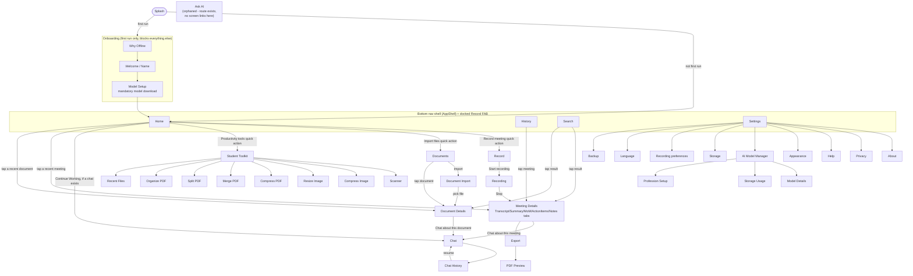

# Navigation Flow

> **Sync note (documentation synchronization pass):** rewritten against the current `lib/core/router/route_paths.dart`, `lib/core/router/app_router.dart`, and `lib/shared/widgets/app_shell.dart`. The prior version described a V1 route set (no Documents, no Chat, no Student Toolkit, no AI Model Manager) with a Conversation Translator screen that no longer exists. Updated again 2026-08-06 for Phase 9.3 (no new routes — folders are inline UI on the existing Documents screen, and Chat gained a no-LLM empty state on the existing `/chat` route; only the shell FAB's icon changed), tag `phase-9-3`.

Routing uses `go_router`. Four destinations (Home, History, Search, Settings) sit inside a persistent bottom-navigation shell (`AppShell`), plus a docked center floating action button that always jumps straight to Record; everything else is a pushed route on top.

## Screen map

**Note on removed/changed navigation:**
- The Decisions tab that used to sit alongside Action Items in Meeting Details was removed — the AI no longer generates decisions (see [`ai-architecture.md`](ai-architecture.md)).
- There is no Conversation Translator screen or route any more — the feature was fully removed.
- `/ask` (the legacy Ask AI screen) is still registered in `app_router.dart` and fully functional, but **no screen in the app navigates to it**. It's reachable only by typing the path directly. See [`ai-architecture.md#the-legacy-ask-ai-feature-orphaned-not-removed`](ai-architecture.md#the-legacy-ask-ai-feature-orphaned-not-removed).
- Home's "Continue Working" section (which links straight into `Chat`) only renders once at least one chat session exists — a first-time user reaches Chat via "Chat about this" on a meeting/document details screen, not from Home directly.

## Route table

| Route | Path | Params | Notes |
|---|---|---|---|
| Splash | `/` | — | Initial route |
| Why Offline | `/onboarding/why` | — | First run only |
| Welcome / Name | `/onboarding/name` | — | First run only |
| Model Setup | `/onboarding/setup` | — | First run only; mandatory model download, blocks all other routes until done |
| Home | `/home` | — | Bottom nav tab |
| History | `/history` | — | Bottom nav tab |
| Search | `/search` | — | Bottom nav tab |
| Settings | `/settings` | — | Bottom nav tab |
| Record | `/record` | — | Pushed |
| Recording | `/record/session` | — | Pushed; state lives in `RecordingController`, not the URL |
| Import | `/import` | — | Pushed; imports an existing audio/video file as a meeting |
| Ask AI | `/ask` | — | Pushed; **orphaned** — no in-app link, see above |
| Meeting Details | `/meetings/:meetingId` | `meetingId` | Pushed. Transcript/Summary/MoM/Action Items/Notes are tabs within this one screen (Decisions was a sixth tab, removed) |
| PDF Preview | `/meetings/:meetingId/export/preview` | `meetingId` | Pushed |
| Export | `/meetings/:meetingId/export` | `meetingId` | Pushed |
| Documents | `/documents` | — | Pushed |
| Document Import | `/documents/import` | — | Pushed; registered before `:documentId` so this static segment matches first |
| Document Details | `/documents/:documentId` | `documentId` | Pushed |
| Chat | `/chat` | — | Pushed; single screen with an in-chat scope selector (workspace/meeting/document — general scope not yet implemented). `state.extra` carries an optional `ChatLaunchArgs` to pre-scope a new conversation or resume a specific one |
| Chat History | `/chat/history` | — | Pushed; resume/rename/pin/delete past conversations |
| Student Toolkit | `/toolkit` | — | Pushed; module home |
| Compress Image | `/toolkit/compress-image` | — | Pushed |
| Resize Image | `/toolkit/resize-image` | — | Pushed |
| Recent Files | `/toolkit/recent` | — | Pushed |
| Scanner | `/toolkit/scan` | — | Pushed |
| Compress PDF | `/toolkit/compress-pdf` | — | Pushed |
| Merge PDF | `/toolkit/merge-pdf` | — | Pushed |
| Split PDF | `/toolkit/split-pdf` | — | Pushed |
| Organize PDF | `/toolkit/organize-pdf` | — | Pushed |
| About | `/settings/about` | — | Pushed |
| Privacy | `/settings/privacy` | — | Pushed |
| Help | `/settings/help` | — | Pushed |
| Appearance | `/settings/appearance` | — | Pushed; theme mode |
| AI Model Manager | `/settings/ai-models` | — | Pushed; download/install/switch/verify/delete per model kind |
| Profession Setup | `/settings/ai-models/setup` | — | Pushed; registered before `:modelId` so this static segment matches first |
| Model Storage | `/settings/ai-models/storage` | — | Pushed; registered before `:modelId` for the same reason |
| Model Details | `/settings/ai-models/:modelId` | `modelId` | Pushed |
| Storage | `/settings/storage` | — | Pushed; recordings/documents/database/cache/backups/toolkit/AI model disk usage |
| Recording preferences | `/settings/recording` | — | Pushed |
| Language | `/settings/language` | — | Pushed; transcription language |
| Backup | `/settings/backup` | — | Pushed; export DB + audio files via the share sheet |

Defined in `lib/core/router/route_paths.dart` (path constants) and `lib/core/router/app_router.dart` (the `GoRouter` config). Every route above is exercised by the route-graph smoke test in `test/widget_test.dart`.

## Bottom navigation shell (`AppShell`)

Only four destinations sit in the persistent bottom nav — Home, History, Search, Settings — plus a docked center `FloatingActionButton` that always jumps to `/record`, regardless of which tab is active. Every content-type detail screen (Documents, Chat, Student Toolkit, and every screen within them) is a pushed route reachable from Home or from a "Chat about this" / "Import" action, not a fifth/sixth bottom-nav tab. This is a deliberate design decision (ADR-014): the same primary action should not appear in more than one place in the nav chrome.

The FAB's icon is a record-dot (`Icons.fiber_manual_record_rounded`), not a microphone — changed in Phase 9.3, since a microphone specifically implied "record a meeting" for an app that is now a multi-content AI workspace (Meetings, Documents, Chat, the Productivity Toolkit); the destination (`/record`) and the app's Material 3 design language are unchanged.

**Document folders (Phase 9.3) are inline UI on the Documents screen, not a new route.** A folder chip row (an "All Documents" chip plus one chip per folder, with create/rename/delete via long-press) filters the same `/documents` list; "Move to folder" is an action on the existing Document Details screen. No new path was added to the route table.
