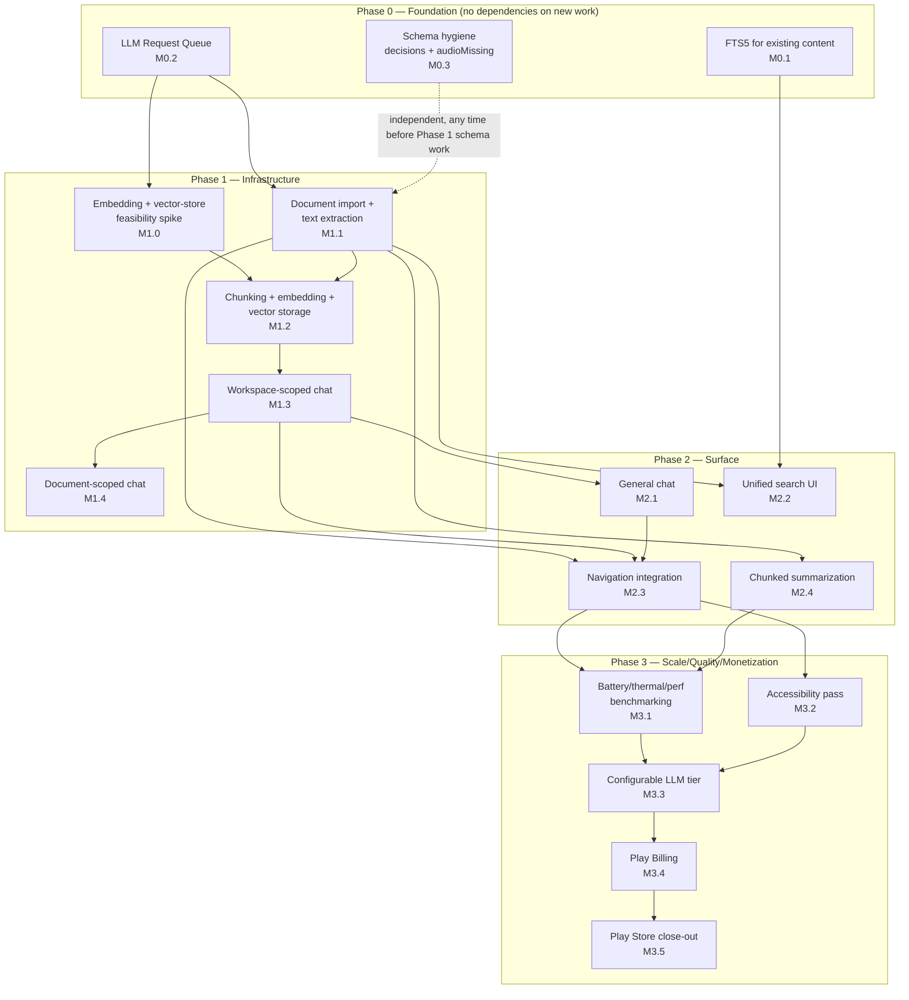

# V2 Module Dependency Graph

Companion to [01-master-roadmap.md](01-master-roadmap.md) (the phased timeline) and [06-module-order.md](06-module-order.md) (the linearized build order this graph justifies).

## Graph

## Critical path

**LLM Request Queue (M0.2) → Embedding Spike (M1.0) → Chunking/Embedding/Storage (M1.2) → Workspace Chat (M1.3) → Navigation Integration (M2.3) → Benchmarking (M3.1) → Configurable Tier (M3.3) → Billing (M3.4) → Launch (M3.5).**

This is the longest dependency chain in the project and determines the minimum possible calendar time to `v2.0.0`. Two links in this chain deserve explicit attention because they're the ones most likely to slip:

- **M0.2 → M1.0**: the queue must exist before the spike, because the spike validates the embedding approach *through* the same engine-access pattern the queue governs — spiking against an unqueued, directly-called engine would validate the wrong integration point.
- **M1.0 → M1.2**: this is the single highest-uncertainty edge in the entire graph (see [04-risk-register.md](04-risk-register.md) R-01/R-02/R-03). Everything downstream of it — every remaining Phase 1 and Phase 2 milestone — is blocked until it resolves. This is precisely why M1.0 is scheduled as early as it can possibly be (immediately after the one Phase 0 dependency it genuinely needs) rather than being deferred until "later, once the easier stuff is done."

## What can run in parallel

Explicitly identified so scheduling doesn't serialize work that doesn't need to be serialized:

- **M0.1 (search/FTS5), M0.2 (LLM queue), and M0.3 (schema hygiene)** have no dependencies on each other and can be built by different people simultaneously within Phase 0.
- **M1.1 (document import/extraction) does not depend on M1.0 (the spike).** Text extraction and document summarization only need the existing LLM engine (via the queue), not embeddings. This is deliberate: it means Phase 1 calendar time isn't fully gated by the spike's outcome — a team can make real, shippable progress on Document import while the spike runs, rather than sitting idle waiting for it.
- **M1.0's two spike tracks** (embedding-model feasibility, vector-storage feasibility) are themselves independent of each other and can run in parallel (see Feature 3.1 in [02-backlog.md](02-backlog.md), tasks 3.1.1.1 and 3.1.1.3).
- **M2.4 (chunked summarization)** depends only on Document import existing, not on the chat modules — can proceed in parallel with M1.3/M1.4/M2.1 once M1.1 is done.
- **M3.1 (benchmarking) and M3.2 (accessibility)** are independent of each other and can run in parallel once Phase 2 is feature-complete.
- **Epic 7's Task 7.3 (V2 testing strategy document) and Epic 1's Feature 1.4 (V1 doc sync)** have no code dependencies at all and can start on day one, in parallel with everything else.

## What must never happen

Per the instruction that no module is scheduled before all of its dependencies exist: **no chat feature (M1.3, M1.4, M2.1) may begin before M1.2 (chunking/embedding/storage) is validated working**, since every chat feature's core value (retrieval-backed answers) depends on it — building chat UI against unvalidated retrieval infrastructure would mean rebuilding it once the real constraints (ADR-011's token budget, whichever vector-storage approach wins) are known. This is the one edge in the graph where "start early to save time" is a false economy, and [06-module-order.md](06-module-order.md) enforces it as a hard gate, not a suggestion.
