# V2 Architecture Diagrams — The System As Built

Every diagram in this document describes the codebase **as it actually exists**, verified against source (`lib/`), not aspirational or planned architecture. Where a diagram would describe something not yet built, it says so explicitly in its own section rather than being presented alongside the real ones without distinction. Most sections describe the state as of Phase 6B; §12/§12b/§12c (the Productivity Toolkit's PDF/OCR/security surface) were updated 2026-08-21 (Documentation Synchronization phase, D-1) to reflect the Productivity Toolkit productization pass (P0-1 through P0-9) and the subsequent release-blocker fixes B1/B2/B3 (`04-risk-register.md` R-47/R-48/R-49) — none of which existed as of the original Phase 6B write-up. §4's R-7 addition (chat composer attachments/voice input, verified against `chat_screen.dart`) was diagrammed for the first time on 2026-08-22 — it existed as prose only since R-7 shipped it, a genuine diagram-coverage gap this pass closed; no other section changed in that pass.

This document lives in `implementation/` (the living, kept-current subfolder), not alongside the frozen `docs/v2/*.md` specification — diagrams describing *what's actually running* belong with the other implementation-status documents ([`10-v2-progress.md`](10-v2-progress.md), [`11-gap-analysis.md`](11-gap-analysis.md)), not retroactively inserted into documents that are deliberately kept as originally written.

**Scope note on diagram count.** The consolidation request named 17 distinct diagram types (High-Level, Low-Level, Feature, Module Dependency, Component, Clean Architecture Layers, AI Pipeline, Hybrid Retrieval Pipeline, Model Manager, Toolkit, Database ER, Navigation, Storage, Document Processing, Meeting Processing, Security, Future Licensing). For a codebase this size, several of those are the same information at different zoom levels — a separate "Low-Level," "Feature," and "Component" diagram alongside "Clean Architecture Layers" and "Module Dependency" would mean four near-identical box-and-arrow diagrams differing mainly in which boxes are expanded. They're consolidated below into **Clean Architecture Layers** (the layering, generic across every feature) and **Module Dependency** (the actual feature/service inventory) rather than duplicated — this is the same "no duplicated widgets/diagrams" discipline this project applies to code. "Hybrid Retrieval Pipeline" is addressed directly under [Retrieval](#4-retrieval--hybrid-pipeline-for-chat-phase-6b-unranked-keyword-search-for-the-search-screen-unchanged) — now real (Phase 6B) and diagrammed as such, superseding this doc's earlier "not implemented, two separate systems" characterization. "Model Manager" is real (Phase 6A) and diagrammed at [§5b](#5b-ai-model-manager-phase-6a--current-implementation), alongside (not merged into) §5's pre-existing AI Pipeline diagram.

---

## 1. High-Level Architecture

**Purpose:** Show the system's one true external boundary — everything else is on-device.

**Design decision:** There is exactly one network-capable edge in the entire application: the first-run AI model download. Every other box in this diagram never makes a network call, by construction (verified across every service in `lib/services/`; grep for `http`/`dio`/network clients outside `lib/services/ai/*.dart`'s model-download paths returns nothing).

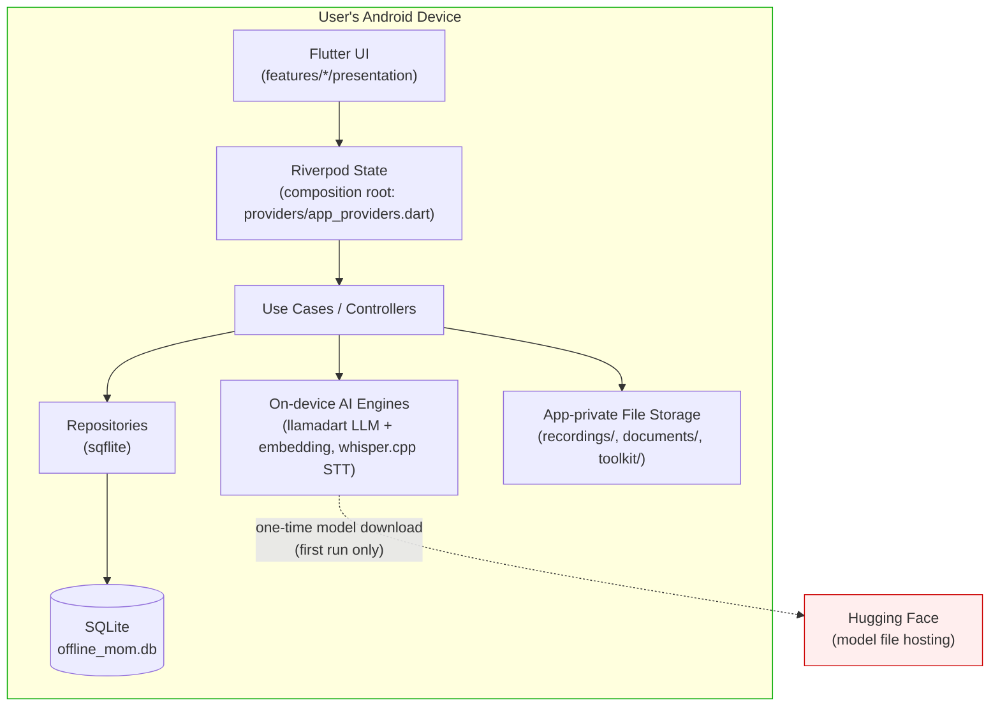

**Trade-off:** No cloud fallback means retrieval/generation quality is capped by what a ~1.5B-parameter model can do on a phone — accepted deliberately per [01-product-vision.md](../01-product-vision.md)'s thesis; the alternative (any cloud call) breaks the product's entire differentiation.

**Future extensibility:** A future licensing/account backend (see [§13](#13-future-licensing-architecture-conceptual-not-implemented)) would add a second, narrowly-scoped network edge — deliberately kept separate from this diagram until it's real.

---

## 2. Clean Architecture Layers

**Purpose:** The one layering pattern every feature follows — consolidates what would otherwise be separate "Low-Level," "Feature," and "Component" diagrams, since they'd all show this same shape per feature.

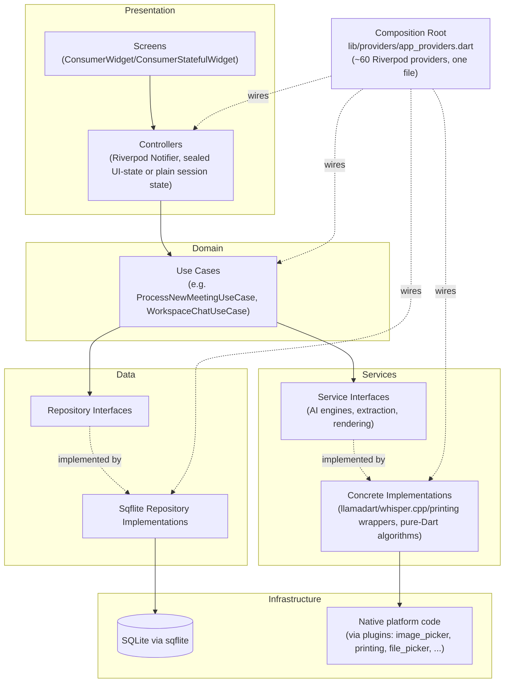

**Responsibilities:** Screens own no business logic (they read controller state and call controller methods); Controllers own UI-facing state and orchestration only; Use Cases own the actual domain rules and are UI-agnostic (constructible and testable with zero Flutter dependency); Repositories own persistence only; Services own one external capability each (one AI engine, one file format, one platform plugin) behind an interface, always with a fake shipped alongside for tests.

**Design decision:** One composition root, not a service locator or per-feature DI setup — every dependency is visible in one file (`app_providers.dart`), which is also why a full engine swap (`flutter_llama` → `llamadart`, V1) cost exactly one provider re-point rather than a scattered refactor.

**Trade-off:** `app_providers.dart` is a large, single file (~60 provider declarations) — accepted because Riverpod's `ref.watch()` graph makes "what depends on what" traceable within it, and splitting it per-feature would fragment the one place a new engineer can see the entire dependency graph at once.

---

## 3. Module Dependency Diagram

**Purpose:** The actual feature/service inventory and which way dependencies point.

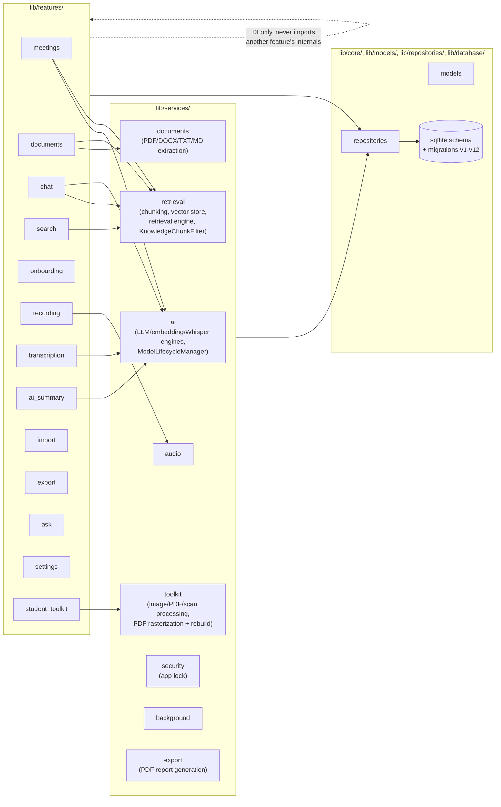

**Design decision:** Features never import each other's internals directly — cross-feature composition happens only through the shared composition root and shared repositories/models, keeping every feature independently removable in principle (verified: `student_toolkit` shares zero files with `documents`/`meetings` beyond the common repository/model/DI layer, despite both being "content the user imported").

**Trade-off:** `services/retrieval` is depended on by three features (meetings, documents, chat, search) and is the single most-coupled service in the app — an accepted, deliberate coupling, since retrieval genuinely is a cross-cutting concern the product vision requires ("chat with everything").

---

## 4. Retrieval — Hybrid Pipeline for Chat (Phase 6B), Unranked Keyword Search for the Search Screen (Unchanged)

**Updated for Phase 6B.** Verified directly against `lib/services/retrieval/hybrid_retrieval_pipeline.dart`, `lib/services/retrieval/hybrid_ranker.dart`, `lib/services/retrieval/keyword_search_service.dart`, `lib/services/retrieval/retrieval_confidence.dart`, `lib/repositories/content_search_repository.dart`, `lib/features/search/search_workspace_use_case.dart`, and `lib/features/chat/workspace_chat_use_case.dart`: **Workspace Chat is now backed by a real, fused vector+keyword hybrid retrieval pipeline** (ADR-037, [03-decisions.md](03-decisions.md)). The Search screen's own retrieval (`content_fts`/`ContentSearchRepository`) is a deliberately separate, untouched system — different granularity (source-item vs. chunk), different consumer, no shared code path, per ADR-037's own "two FTS5 tables, deliberately not merged" decision.

```mermaid
flowchart TB
    subgraph HybridPath["Hybrid retrieval — powers Workspace Chat"]
        Q1["User question"] --> Classify["QueryClassifier\n(6 pre-retrieval types via\nChatScope + regex patterns)"]
        Classify --> Embed["EmbeddingEngine.embed()\n(embeddinggemma-300M, on-device,\ncalled once)"]
        Embed --> VS["BruteForceVectorStore.similaritySearch()\ncosine similarity over knowledge_chunks"]
        Embed -. "reused, not re-embedded" .-> ConfScore
        Classify --> KW["SqfliteKeywordSearchService.search()\nBM25 over knowledge_chunks_fts\n(migration v14, trigger-synced)"]
        Filter1["KnowledgeChunkFilter\n(contentType/owner/meetingId/documentId)\n- built from ChatScope"]
        Filter1 -.applied to both.-> VS
        Filter1 -.applied to both.-> KW
        VS --> Fuse["HybridRanker.fuse()\nReciprocal Rank Fusion (rrfK=60)\n+ capped recency boost\n+ dedupe by chunk id"]
        KW --> Fuse
        Fuse --> ConfScore["RetrievalConfidenceScorer\nrecomputed cosine on top fused chunk\n-> high / medium / low / none"]
        ConfScore -->|"high / medium"| Budget["TokenBudgetSelector\n(charBudget=4000, never cuts\na chunk mid-way)"]
        Budget --> Ctx["ContextBuilder\n(## label \\n text \\n\\n)"]
        Ctx --> LLM["LlmEngine.answerQuestionStream()\n(strict, context-only prompt)"]
        LLM --> Answer["Answer + real citations\n(per-source confidence %)\nAnswerProvenance.local"]
        ConfScore -->|"low / none"| GK["LlmEngine.answerGeneralKnowledgeStream()\n(permissive prompt, temp 0.4,\nno context passed at all)"]
        GK --> AnswerGK["Answer, sources = []\n(never fabricated)\nAnswerProvenance.generalKnowledge\nshown as a distinct UI banner"]
    end

    subgraph KeywordPath["Keyword search — powers the Search screen (unchanged)"]
        Q2["Search query"] --> FTS["content_fts MATCH query\n(SQLite FTS5, source-item granularity)"]
        FTS --> Results["Matching meetings/documents/notes\n(deduped by id, NOT ranked by\nbm25() - unchanged from before Phase 6B)"]
    end

    HybridPath -. "separate table, separate\ngranularity, no shared code" .- KeywordPath
```

**What's real:**
- **Hybrid path** (chat/RAG): classifies the query, embeds the question once, runs vector similarity search and BM25 keyword search concurrently over the same `knowledge_chunks`/`knowledge_chunks_fts` corpus (both filtered by the same `KnowledgeChunkFilter`), fuses the two ranked lists via Reciprocal Rank Fusion with a small capped recency boost, then recomputes a real cosine confidence score on the fused top result. **High/medium confidence** → the LLM answers strictly from the token-budget-selected, deduplicated context, with real per-chunk citations. **Low/none confidence** (including a genuinely empty corpus) → the LLM answers from its own general knowledge instead of a fixed refusal string, with `sources` always empty and `AnswerProvenance.generalKnowledge` persisted and shown distinctly in the UI — never presented as if it came from the user's own documents. Every call also returns a `RetrievalStats` record (vector/keyword/fused/selected candidate counts, truncation flag, elapsed time) for diagnostics — in-memory per-query only, not persisted to a new table (ADR-037).
- **Keyword path** (Search screen): unchanged from before Phase 6B — a plain FTS5 `MATCH` query against `content_fts` (source-item granularity, no BM25 ranking exposed). This is intentional (ADR-037): unifying it with the chat-side chunk-granularity index would complicate the simpler, already-working Search screen for no benefit to it.

**Trade-off (current, real):** The Search screen still doesn't benefit from BM25 ranking or semantic matching — a search for "budget" still won't find a meeting that only said "spend." This is an explicitly scoped-out gap, not an oversight: Phase 6B's brief was Chat's retrieval quality, and `content_fts`/`SearchWorkspaceUseCase` were deliberately left untouched to avoid an unrelated redesign. If Search-side ranking/semantic matching is ever wanted, it would reuse `knowledge_chunks_fts`/`VectorStore` rather than duplicating the hybrid pipeline — an open future direction, not decided here.

**R-7 addition — chat composer attachments and voice input (no new retrieval system).** `ChatScreen`'s composer (`lib/features/chat/presentation/screens/chat_screen.dart`) gained an attach button and a mic button. Neither adds a second RAG path — both reuse pipelines this document already diagrams elsewhere (diagram 6 for import, §5/AI Pipeline for transcription):

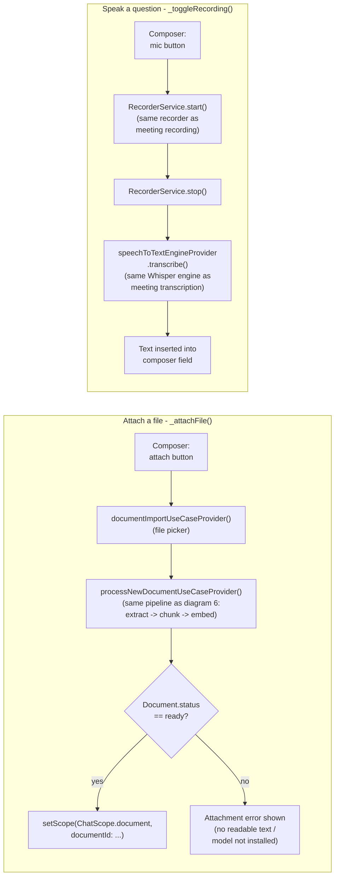

Both are pre-send-only (scope/text field state, fixed once a conversation starts, same as every other `ChatScope` choice) and both fail visibly — a `SnackBar`/inline error, never a silent no-op. Image attachments are not supported: this app's Documents pipeline has no OCR/text-extraction path for images (`ocr_parser.dart` is deliberately unimplemented, ADR-015) — extending that is a real scope decision, not made in this pass.

---

## 5. AI Pipeline & Model Lifecycle

**Purpose:** How the three on-device models are downloaded, loaded, used, and unloaded.

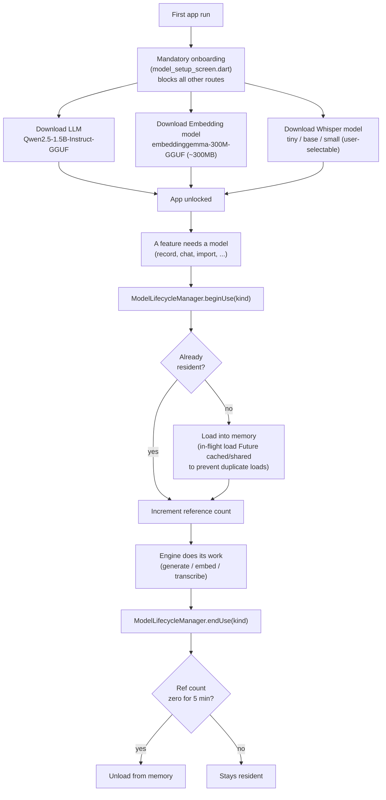

**Responsibilities:** `ModelLifecycleManager` owns *residency* (load/unload/reference-counting) uniformly across all three model kinds; it does not own downloading (each engine's own `_ensureLoaded()` sources its model via `llamadart`'s `ModelSource.parse()` against a Hugging Face URI) and does not own inference (each engine's own `answerQuestionStream`/`embed`/`transcribe` method does that).

**Design decision:** Models are downloaded on first run, not bundled into the app package — trades a mandatory first-run network step for a dramatically smaller install size; explicitly still an open product question per [20-future-roadmap.md](../20-future-roadmap.md), not silently decided.

---

## 5b. AI Model Manager (Phase 6A — Current Implementation)

**Purpose:** Independent download/install/switch/verify/delete for each model kind, plus profession-based recommendations - built on top of §5's lifecycle machinery, not a replacement for it. See ADR-036 ([03-decisions.md](03-decisions.md)) for the full set of scope decisions this diagram summarizes.

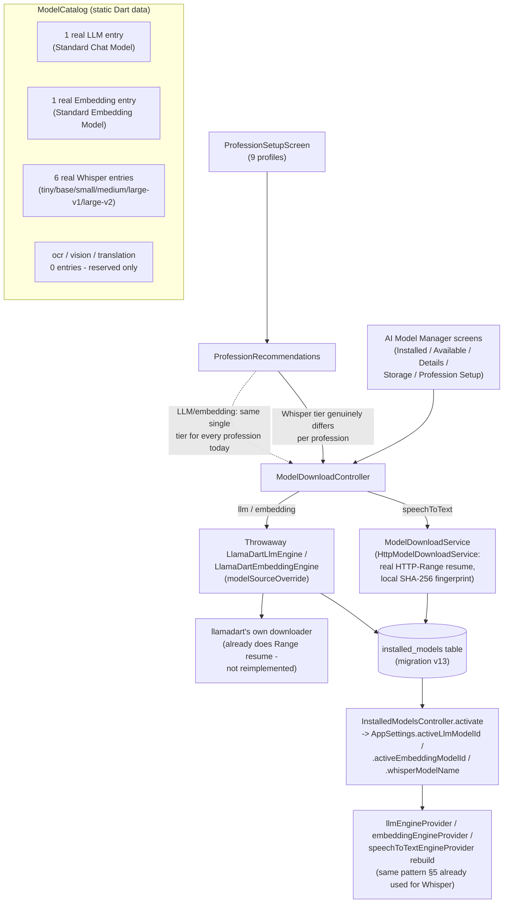

**What's real vs. honestly thin, stated once here:** every arrow above is real, working code - but the catalog box shows exactly what exists: one Chat LLM tier, one Embedding tier, six Whisper tiers, and zero entries for the three future kinds. `ProfessionRecommendations` genuinely differentiates the Whisper recommendation per profession (real accuracy/RAM/storage/speed trade-offs); it recommends the same LLM/embedding entry for every profession because there is nothing else to recommend yet (ADR-036).

**Design decision (split download strategy):** Whisper downloads go through a new, purpose-built `ModelDownloadService` because `whisper_flutter_new`'s own downloader — and this app's prior hand-rolled replacement for it — had no resume/checksum support at all. LLM/embedding downloads instead reuse `llamadart`'s own internal downloader (confirmed by source inspection to already do real HTTP-Range resume) through a throwaway engine instance pointed at the target catalog entry — reusing a working implementation rather than reimplementing it.

**Trade-off (disclosed, not hidden):** Deleting an installed LLM/embedding model removes this app's own tracking row but cannot guarantee `llamadart`'s on-disk cache file is removed (no public per-model eviction API exists in that package) - the Storage Usage screen's blunt "Delete Cache" action is the honest way to reclaim that space (R-37, [04-risk-register.md](04-risk-register.md)).

**Future extensibility:** `ModelKind.ocr`/`.vision`/`.translation` already exist as enum values with zero catalog entries - `ModelLifecycleManager`, the database schema, and every AI Model Manager screen are already generic over `ModelKind`, so adding a real engine for one of these three later is additive (new engine + new catalog entries), never a refactor of this diagram's boxes.

**UI update (Phase 9.3, tag `phase-9-3`):** `ProfessionSetupScreen`'s "Set up these models" flow now surfaces `ModelDownloadController`'s existing per-model state (name/size/percentage, `Idle`/`InProgress`/`Paused`/`Verifying`/`Failed`/`Done`) directly in the UI, plus a Cancel action and an upfront connectivity check — a UI-layer change consuming the state this flowchart's boxes already produced, not a change to the pipeline itself. See ADR-039.

---

## 6. Document Processing Pipeline

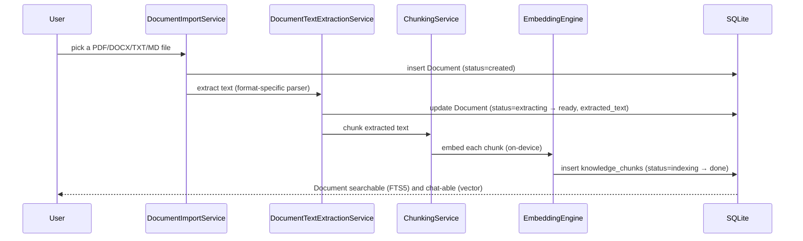

**Trade-off:** Extraction and indexing are two separate background stages (a document is searchable via FTS5 as soon as extraction finishes, chat-able only once indexing/embedding also finishes) — this staged visibility is intentional, not a bug, so a user isn't blocked from any capability longer than the specific pipeline stage it actually depends on.

---

## 7. Meeting Processing Pipeline

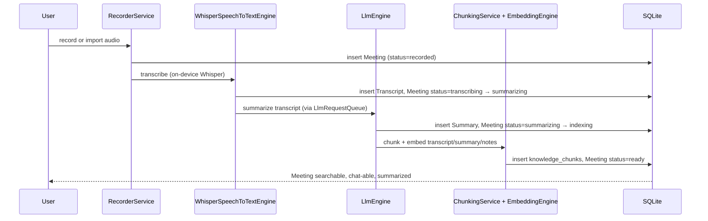

---

## 8. Database Entity-Relationship Diagram

Every table currently in the schema (migrations v1–v15, v15 shipped in Phase 9.3, tag `phase-9-3` — see [`10-v2-progress.md`](10-v2-progress.md)), verified against `lib/database/tables.dart`. Kept in sync with [`../../architecture/database-design.md`](../../architecture/database-design.md), which carries the full column-level detail; this diagram is the abbreviated version.

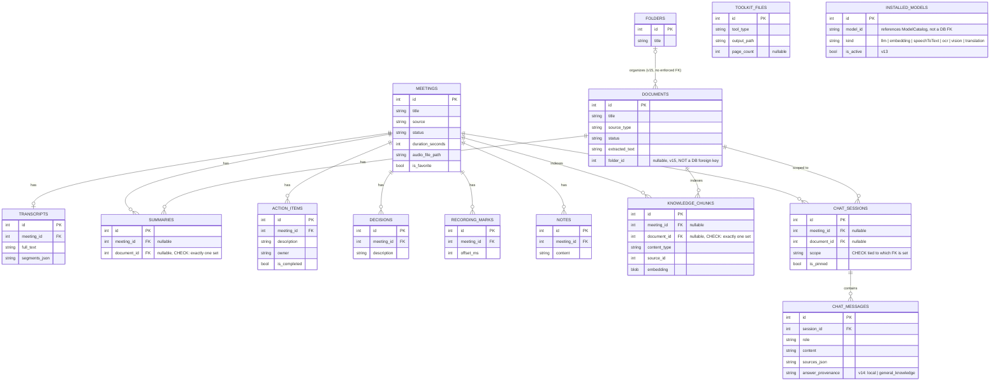

**Design decision (polymorphic ownership):** `summaries`, `knowledge_chunks`, and `chat_sessions` all use the same pattern — two nullable FKs (one to `meetings`, one to `documents`) with a `CHECK` constraint enforcing exactly one is set, rather than either a separate `document_summaries` table or an unenforced `(owner_type, owner_id)` pair. See ADR-005 for the full reasoning.

**`content_fts` and `knowledge_chunks_fts` (FTS5 virtual tables, not shown above):** SQLite FTS5 virtual tables don't support real foreign keys — their `meeting_id`/`document_id`/`rowid` references are informal, trigger-synced, not enforced constraints. Omitted from the ER diagram above since Mermaid's `erDiagram` syntax models real relational constraints, and drawing an unenforced reference the same way as an enforced one would misrepresent it. `knowledge_chunks_fts` (v14) is a second, separate chunk-granularity index powering Hybrid Retrieval's keyword half — see §4 below and ADR-037.

**`toolkit_files` and `installed_models` have no foreign keys at all** — deliberately not owned by any meeting/document/chat entity (Student Toolkit outputs and installed-model tracking are both standalone content types; see ADR-033 and ADR-036).

**`documents.folder_id` (v15) is deliberately not a foreign key either**, for the same reason — validated at the repository layer (`FolderRepository`/`DocumentRepository`), not the schema layer. See ADR-039 and [`../../architecture/database-design.md`](../../architecture/database-design.md).

---

## 9. Navigation Flow

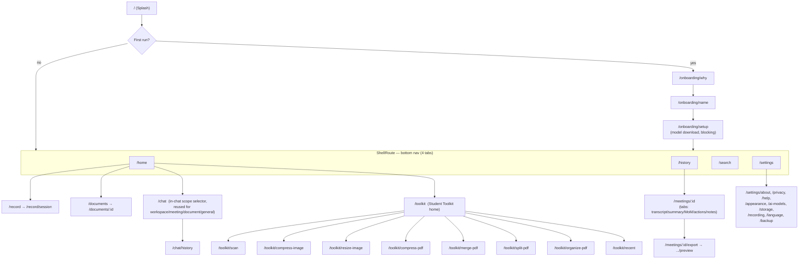

**Design decision:** Only the 4 core "always relevant" destinations sit in the bottom nav; every content-type detail screen and every tool is a pushed route reachable from Home's Knowledge Source pillars or the Student Toolkit's own sections — deliberately avoiding V1's own past mistake of the same primary action appearing three times in the nav (see ADR-014).

---

## 10. Storage Architecture

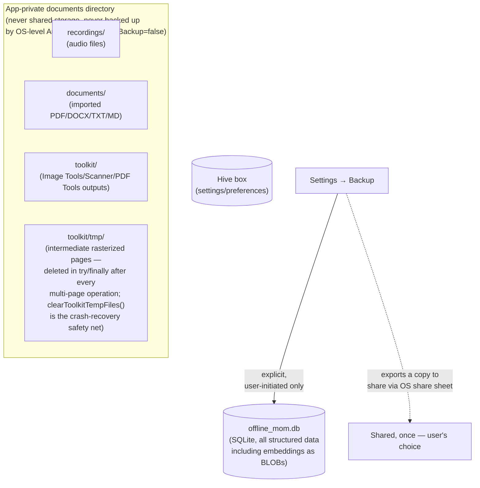

**Design decision:** Backup/export is the *only* path any of this data ever leaves the app's private storage, and it's always an explicit user action (Settings → Backup → Share), never automatic. `android:allowBackup="false"` (ADR-032) additionally blocks the OS's own automatic backup mechanisms from doing this implicitly.

**Trade-off:** `toolkit/tmp/` is the one place in the entire app that ever holds an intermediate file mid-operation (multi-page PDF work can't stay fully in memory) — accepted as necessary after Phase 4B's leaked-backup-file lesson made the cost of *not* having a `try/finally` + safety-net discipline for temp files very clear (ADR-032, ADR-034).

---

## 11. Security Architecture

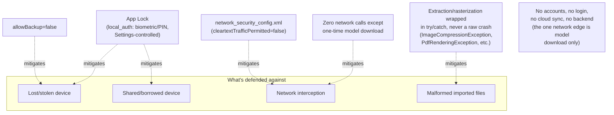

**Design decision:** Security here is almost entirely about *containment* (nothing leaves the device) rather than *access control* to a remote resource, since there is no remote resource — App Lock is the one meaningful access-control layer, gating the app itself, not any particular piece of data within it.

---

## 12. Productivity Toolkit Module

**Updated 2026-08-21 (Documentation Synchronization, D-1).** This section previously described only the Phase 5B state (7 tools, no Edit/Redact/OCR/Security/File-Manager surface) — rewritten against the actual current `ToolkitToolType` enum (`lib/models/toolkit_file.dart`, 14 values) and the P0-1 through P0-9 productization pass (ADR-040 through ADR-047, `03-decisions.md`).

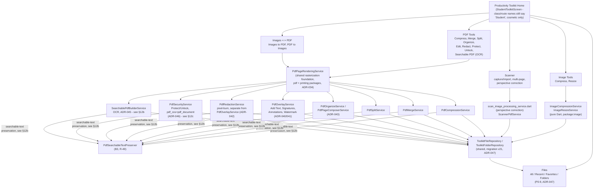

**Design decision:** Every tool writes to the same `ToolkitFileRepository`/`toolkit_files` table regardless of which of the **14** `ToolkitToolType` values it is (`imageCompress`, `imageResize`, `scan`, `pdfCompress`, `pdfMerge`, `pdfSplit`, `pdfOrganize`, `pdfEdit`, `pdfRedact`, `imagesToPdf`, `pdfToImages`, `ocr`, `pdfProtect`, `pdfUnlock`) — file listing, storage accounting, and rename/favorite/duplicate/delete are genuinely shared, not duplicated per tool. `pdfEdit` and `pdfRedact` are deliberately separate tool types, not variants of one "edited" type, since they carry different security properties (`pdfEdit`'s output still contains its full original page content underneath any overlay; `pdfRedact`'s output has had the selected regions' original pixels permanently overwritten) — see ADR-040/ADR-042. See §12a for the File Manager's own architecture (P0-9, migration v21), §12b for OCR + the B3 searchable-text-preservation mechanism, §12c for PDF Security.

**Not implemented — stated explicitly, not by omission:** PDF→DOCX, DOCX→PDF, DOCX editing, or any other Office-document conversion; a standalone Crop PDF tool (Scanner's own perspective-correction screen covers rectangular cropping as a special case of its general four-corner transform, ADR-034 — there is no separate "Crop PDF" entry point); a standalone Image Crop tool (Image Tools ships Compress and Resize only). None of these are stubbed, fake, or partially wired — they do not exist in `lib/` at all, confirmed by direct source inspection for this synchronization pass (zero `docx` references anywhere under `lib/features/student_toolkit/`, and the `ToolkitToolType` enum above is the complete, exhaustive list of what the Toolkit can produce).

**Approved Future Architecture, not yet built (naming only):** the product-facing "Student Toolkit" → "Productivity Toolkit" rename is an approved future direction (ADR-035), reflecting personas beyond students already served today (job seekers, teachers, freelancers, accountants, small business owners — see [20-future-roadmap.md](../20-future-roadmap.md)). The class/route/table names (`StudentToolkitScreen`, `/toolkit`, `student_toolkit/`) still say "Student" today and are not required to change — a cosmetic, mechanical rename that can happen independently of the marketing/UI-copy change (which already says "Productivity Toolkit" in-product), and not performed in this documentation-only pass.

---

## 12a. File Manager (P0-9, ADR-047)

**Purpose:** Show why `toolkit_folders` is a second, deliberately separate folder table from `documents`' own `folders` table, not a shared one.

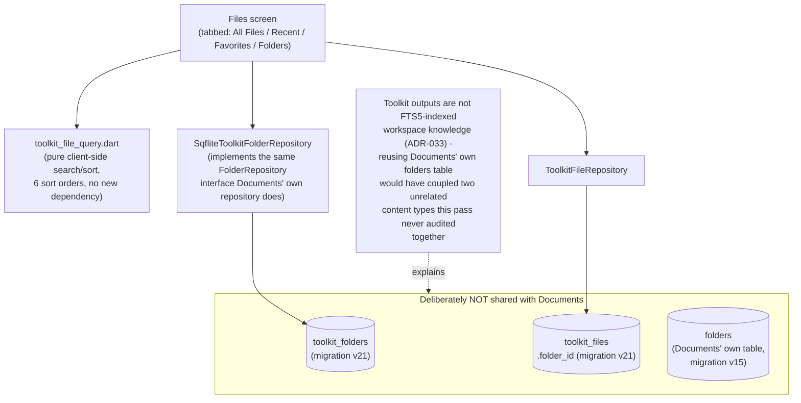

**Design decision:** `toolkit_folders` (migration v21) mirrors `documents`' own `folders` table's *shape* (same `Folder` model, same `FolderRepository` interface) but is a genuinely separate table — Toolkit outputs and imported Documents remain two independent content universes, matching ADR-033's original "toolkit outputs aren't Knowledge Sources" decision, which this pass deliberately did not reverse (see §5 of `13-productivity-toolkit-productization-audit.md`'s own option (a) vs. (b) analysis). The Files screen's four tabs (All Files / Recent / Favorites / Folders) plus search/sort/multi-select/bulk-delete/bulk-share/missing-file-chip/duplicate-name handling are all real, shipped P0-9 capabilities, not partial.

---

## 12b. OCR + PDF Transformation / Searchable-Text-Preservation Pipeline (P0-7 ADR-045; B3 R-49)

**Purpose:** Show (1) how a scanned page becomes a searchable PDF, and (2) how every rasterize-and-rebuild PDF Tool now preserves — rather than silently destroys — a page's existing searchable text, including OCR's own invisible text layer. This is the diagram this synchronization pass was specifically written to add.

**OCR itself:** `flutter_tesseract_ocr` (real native `TessBaseAPI`, BSD-3-Clause) via `TesseractOcrTextExtractionService`. **English only** is shipped today (`ModelCatalog.ocrEnglish`, `tessdata_fast/eng.traineddata`, ~3.92MB) — other `tessdata_fast` languages could not be independently verified to exist as of ADR-045 and are not offered; do not read this as multi-language support. The model downloads through the same `ModelDownloadService` HTTP-range-resume/SHA-256-fingerprint machinery every other AI model in this app uses (ADR-036) — no bundled `.traineddata`, confirmed absent from the release APK by direct inspection during the 2026-08-20 Release Candidate audit. OCR is `required: false` in `OfflineReadinessCheck` — not downloading it never blocks the app's own "offline ready" state. Recognition runs via Tesseract's real `hOCR` output (`hocr_parser.dart`), giving genuine per-word pixel bounding boxes — not glyph-perfect: the invisible text's own font metrics don't reproduce Tesseract's source glyph shapes exactly, so a hand-drawn selection in a real PDF viewer won't trace the visual word outline pixel-for-pixel (R-44, disclosed, not fixed by this pass).

**The B3 problem this pipeline now solves:** every PDF Tool in this app rasterizes each page to a flat image and rebuilds a new PDF from those images (ADR-034) — this used to silently discard *any* existing searchable text on a page, including OCR's own invisible layer, the moment a user ran Compress/Merge/Split/Organize/Edit/Redact on an already-searchable PDF. `PdfSearchableTextPreserver` (`lib/services/toolkit/pdf_searchable_text_preservation.dart`) fixes this — see R-49, `04-risk-register.md`.

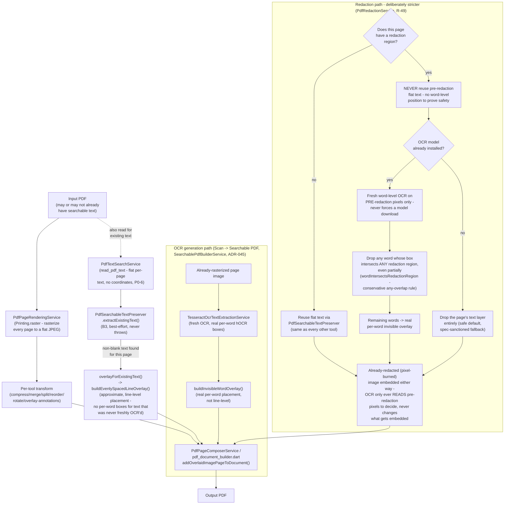

**Governing rule (R-49):** "a false removal is acceptable, a false preservation of sensitive text is not." Five tools (Compress/Merge/Split/Organize/Edit) reconstruct searchable text unconditionally, with zero OCR calls — `PdfTextSearchService` genuinely extracts this app's own invisible OCR text too, since PDF text-rendering mode only controls *painting*, never whether the text-showing operator exists in the content stream. Permanent Redaction is the one deliberate exception: it never reuses flat pre-redaction text on a page it actually redacts, and only attempts word-level preservation via fresh OCR when a model is already installed — never forcing a download just to preserve searchability.

**Known, disclosed limitation:** reconstructed text on non-redacted pages is placement-approximate (line-level, evenly spaced down the page) wherever no fresh per-word OCR boxes exist for that specific rebuild — the same "not glyph-perfect" limitation R-44 already discloses for OCR's own primary pipeline, not a new one. Real-device confirmation that a real PDF viewer's Ctrl+F genuinely indexes this app's invisible text layer the same way `read_pdf_text` does remains unverified (no physical device in this implementation environment — R-32/R-44 and successors).

---

## 12c. PDF Security — Password Protection / Unlock (P0-8, ADR-046)

**Purpose:** Show the real encryption/decryption path, and make explicit what it does and does not guarantee.

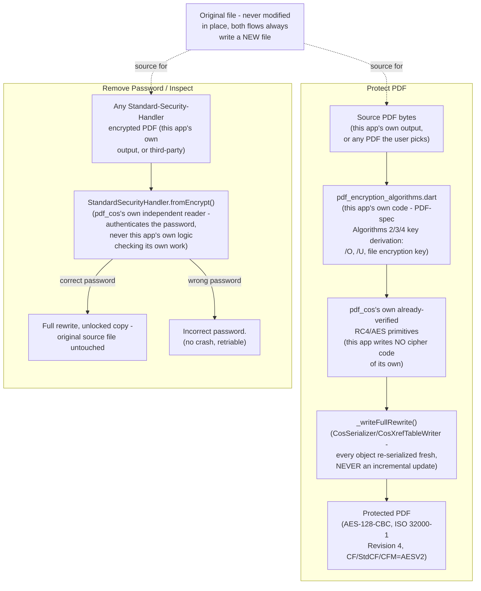

**What is proven:** `pdf_encryption_algorithms_test.dart` cross-validates this app's own write-side key derivation against `pdf_cos`'s independent read-side `StandardSecurityHandler` (not merely self-consistency); `pdf_security_service_test.dart` runs 28 scenarios (corrupted/already-encrypted/wrong-password/owner-password/multi-page/large-PDF), each independently reopened via `CosDocument.open`; a manual demo zlib-decompresses a protected PDF's own content streams and confirms **zero** recoverable plaintext, while the unlocked copy restores the original searchable text exactly.

**What is explicitly NOT claimed, per this app's own no-fabrication discipline:** universal compatibility with arbitrary third-party encrypted PDFs. `removePassword()`/`inspect()` can open any Standard-Security-Handler-encrypted PDF this library's algorithms cover, but this has only been tested against PDFs this app itself produced and hand-constructed test fixtures — not against a real, varied corpus of PDFs from other producers (Adobe Acrobat, Microsoft Print to PDF, other mobile scanning apps, R5/R6/AES-256-encrypted files) in any real environment. This is R-45's own standing disclosure, re-confirmed unchanged by the 2026-08-20 Release Candidate audit (Security Audit item B: "PASS for this app's own output, CONCERN for arbitrary third-party PDFs — never tested against real-world producer diversity").

---

## 13. Future Licensing Architecture — Approved Future Architecture (conceptual, not yet implemented)

**Nothing in this section exists in the codebase today.** No licensing code, no account system, no backend of any kind exists in `lib/`. What *has* changed since this diagram was first drafted: licensing/premium architecture in general — a licensing-only backend, Play Billing integration, a premium tier — is now an **approved future direction** (ADR-035, [03-decisions.md](03-decisions.md)), not merely a conceptual sketch under consideration. This diagram is still deliberately drawn with different visual treatment and an explicit "NOT BUILT" label, because approval of the *direction* is not the same as approval of *this specific design* — the specific option among [18-subscription-model.md](../18-subscription-model.md)'s Option A/B/C remains an open implementation decision ADR-035 explicitly does not resolve.

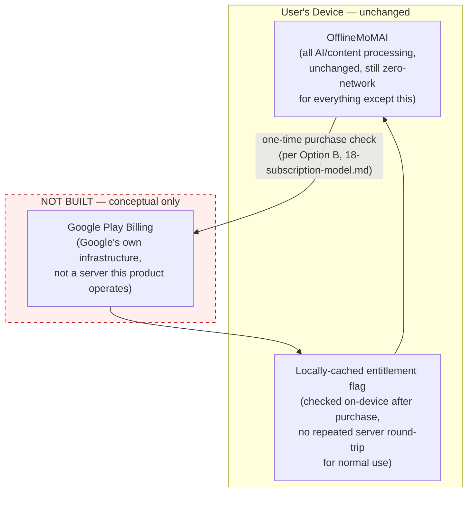

**Why this stays this narrow even conceptually:** [18-subscription-model.md](../18-subscription-model.md) already reasons through why a custom backend for licensing would violate the "no backend, ever" constraint, and why Play Billing's own on-device entitlement API avoids that entirely. This diagram is a visual restatement of that document's Option B, not a new decision — no new backend is proposed here, conceptually or otherwise. If a **licensing/account backend beyond Play Billing** is ever seriously considered (e.g. for B2B/organizational licensing, mentioned as an open idea in [04-risk-register.md](04-risk-register.md) R-14), that would be a materially different, much larger architectural decision requiring its own ADR and its own threat-model update to [16-security.md](../16-security.md) — not something this consolidation pass decides or designs.
