# V3 Architecture Diagrams

Consistent with `docs/v3/01-prd.md` §22. Every diagram below is labeled either **[Built]** — verified against actual source this session — or **[Planned]** — not yet implemented, described exactly as the PRD specifies it, never presented as if it already exists. Mirrors [docs/v2/implementation/12-architecture-diagrams.md](../../v2/implementation/12-architecture-diagrams.md)'s own "as-built vs. planned" discipline.

**Last updated:** 2026-08-22, readability/accuracy correction pass. Diagram 1 was rewritten as a short, compact index (it previously duplicated diagrams 2–6's own detail in one wide graph); a new diagram 10 ("Resume Creation Entry Points") was added showing all three ways a resume gets created side by side; the prior §10/§11 (R-7/R-10 detail diagrams) are renumbered §11/§12 to make room, content unchanged. Diagrams 2–9 reflect Milestone 5 and the Reliability-Overhaul/Product-Quality Remediation passes, unchanged in this pass. No [Planned] boxes remain in diagram 1, except where the PRD itself describes a deferred, explicitly-not-built item. R-6 and R-8 (see [10-v3-progress.md](10-v3-progress.md)) added no new component or flow — both were bugfixes/widget-placement changes to already-diagrammed screens (the gallery's thumbnail-serialization fix, `AiDisclaimer` placement) and are recorded there, not as new diagrams here.

## 1. V3 High-Level Architecture — Map, Not Detail

**Purpose of this diagram changed in this pass.** It previously tried to show every component's full detail (multi-line rationale, decision IDs, milestone tags) for all four layers in one wide graph — duplicating what diagrams 2–6 below already show in focused, full detail, and wide enough to need horizontal scrolling. It's now a compact index: short labels only, one arrow per real dependency, "see diagram N" pointers for the actual detail. Nothing below is new — every component and link already existed, just re-presented for readability.

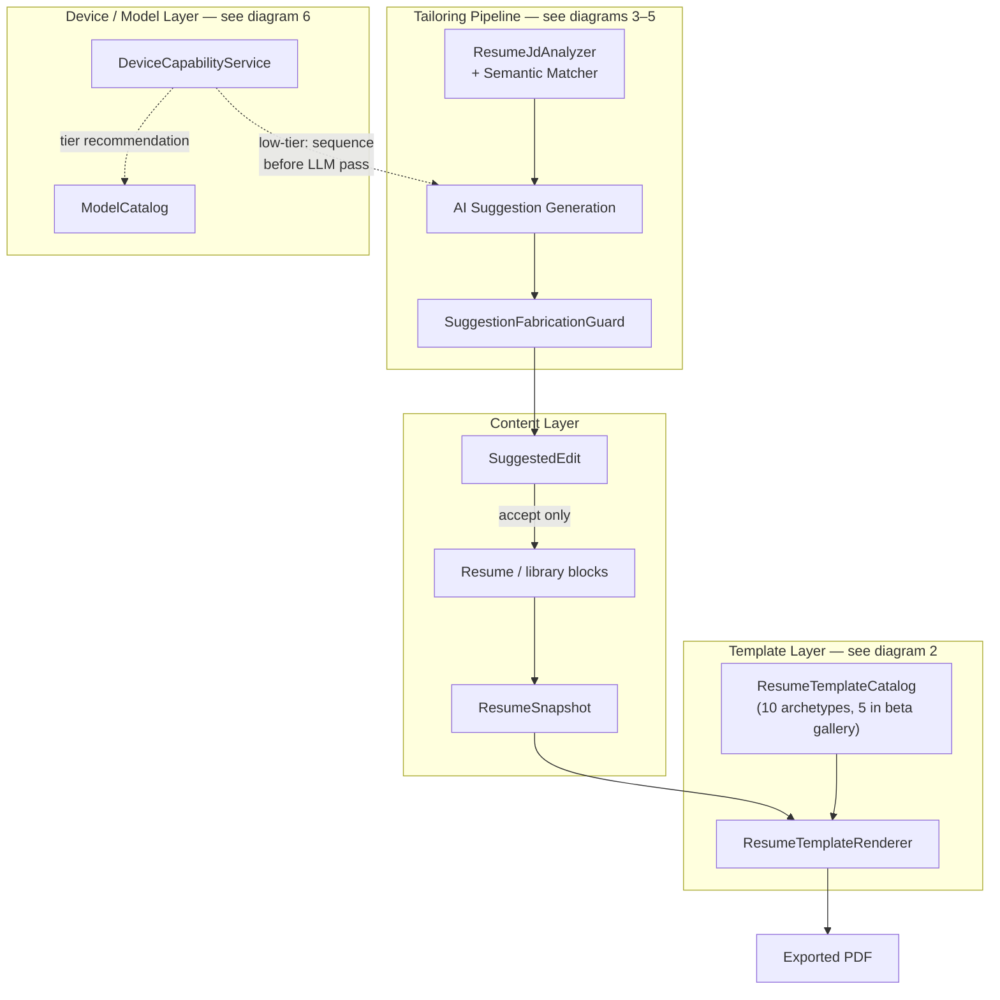

**Where each layer's full detail lives:** Content/Template → diagram 2. Tailoring → diagrams 3, 4, 5. Device/Model → diagram 6. Milestone-by-milestone build history → diagram 7. Three ways a resume actually gets created (blank, from a JD, Beginner Resume) → diagram 10.

## 2. Resume Content → Compiler → Template Renderer → PDF [Built, M1]

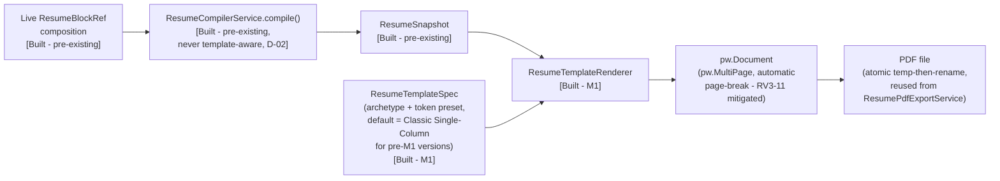

**Note:** the Two-Column Sidebar archetype's internal composition uses `package:pdf`'s `Partitions`/`Partition` (not `pw.Row`/`pw.Expanded`) specifically for cross-page spanning correctness — see D-M1-02, [03-decisions.md](03-decisions.md).

## 3. JD Tailoring Pipeline — Deterministic + Semantic Matching + Prioritization [Built, M2]

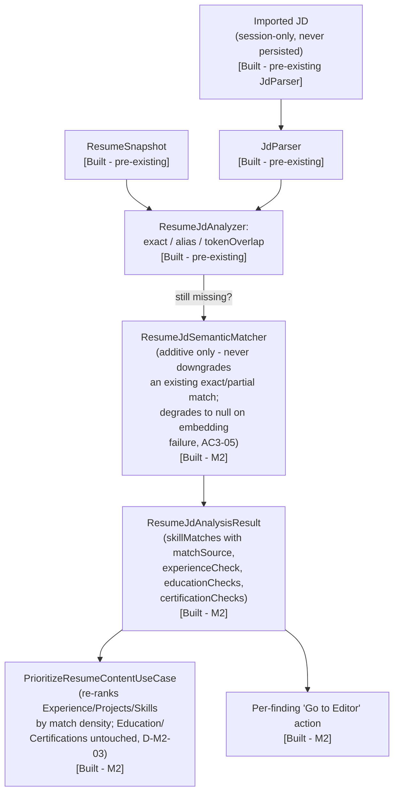

## 4. AI Suggestion Generation → Fabrication Flag → Review [Built, M3]

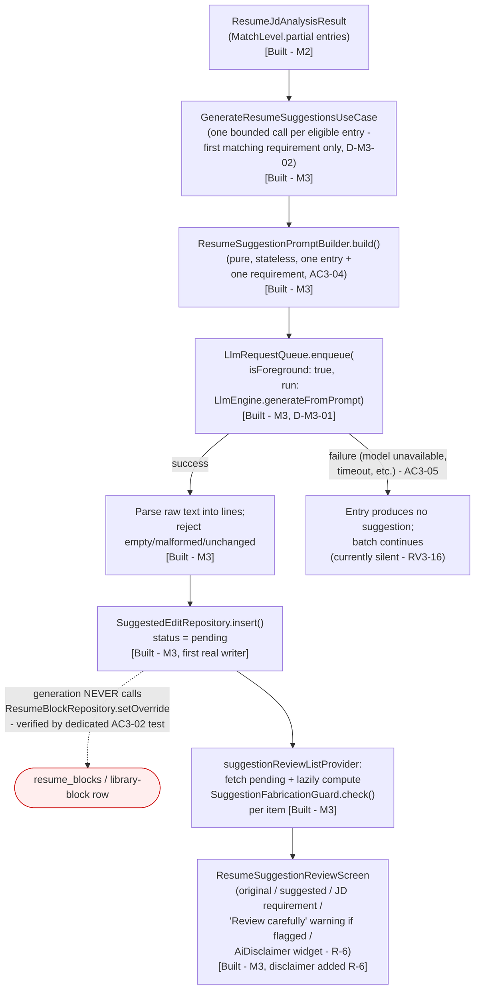

## 5. Accept / Reject Lifecycle [Built, M3] — the architectural enforcement of AC3-02

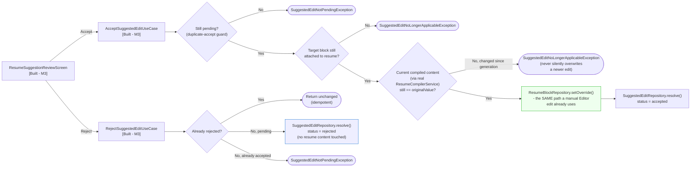

**Fabrication guard is not part of either flow above** — confirmed by direct inspection, `SuggestionFabricationGuard` is not imported by `accept_suggested_edit_use_case.dart` or `generate_resume_suggestions_use_case.dart`. It only ever runs inside `suggestionReviewListProvider` (diagram 4), purely to compute what the review screen displays.

## 6. Model / Device Sequencing — [Built, M5]

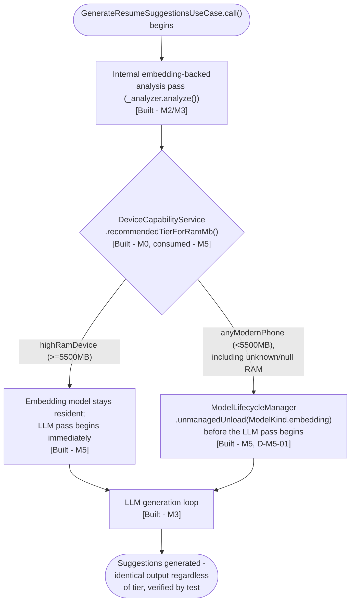

**As built today:** `DeviceCapabilityService` (M0) is now consumed by `GenerateResumeSuggestionsUseCase._releaseEmbeddingModelIfLowTier()` (M5) — the single point in the codebase where the embedding-backed analysis pass and the LLM-backed generation loop run back-to-back in one function call with no user-interaction gap, making it the correct, sufficient insertion point (D-M5-01). Verified by 5 dedicated tests in `generate_resume_suggestions_use_case_test.dart`. **Not yet verified under real memory pressure on an actual low-RAM device** — RV3-12 remains open; this diagram reflects the code-level implementation, not a real-device benchmark.

## 7. V3 Milestone Dependency Flow

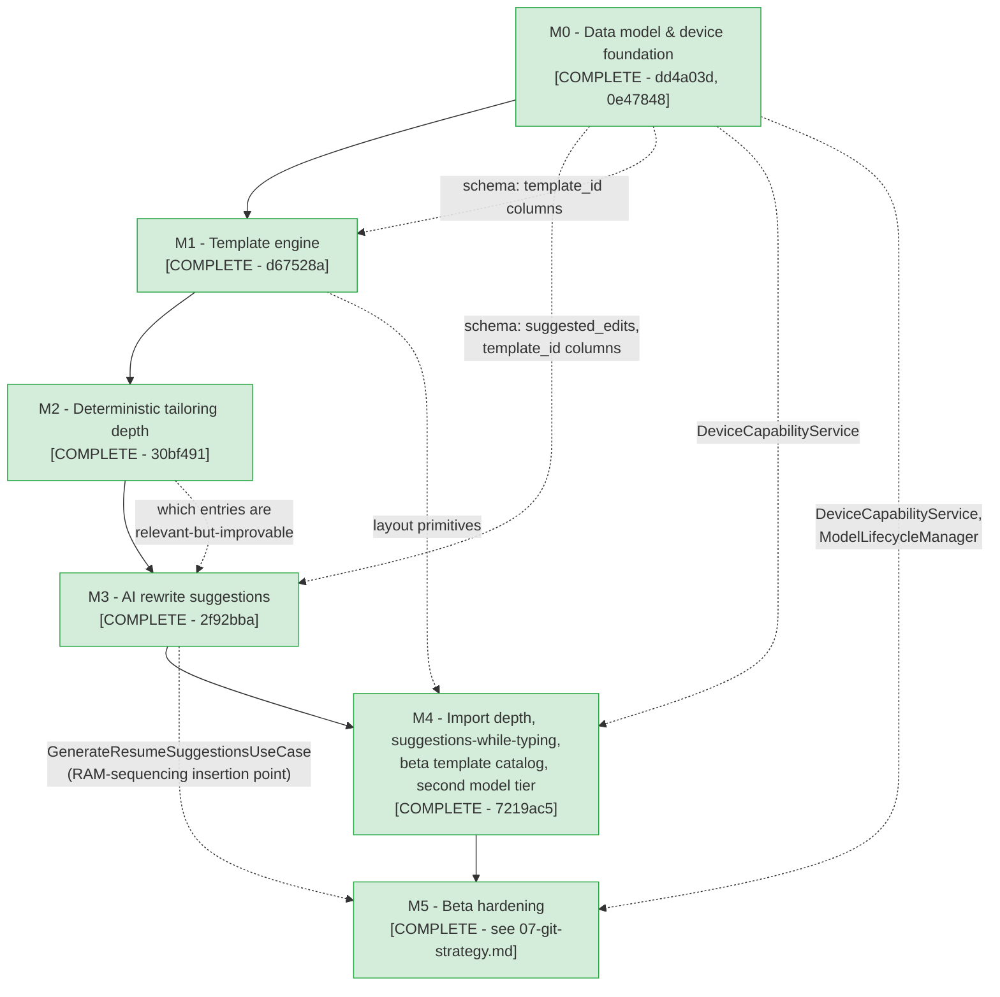

**Beta-readiness note:** every box above is [COMPLETE] in the sense of "that milestone's own scoped work is done, tested, and gated" — this is not the same claim as "every real-device or human-judgment verification has occurred." See [09-definition-of-done.md](09-definition-of-done.md) for the three specific categories (real-device, human-visual, widget-test breadth) still disclosed as outstanding after Milestone 5.

## 8. Offline Readiness Check — [Built, Reliability-Overhaul Pass]

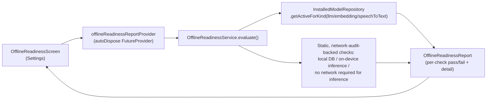

A capability check, not a live connectivity probe — `D` reads the same `InstalledModel.isActive` rows the AI Model Manager itself reads (never a fresh guess), and `E` asserts facts directly backed by a real code audit (no `http`/`dio` dependency, no analytics SDK, the only real network code is the two model-download paths — `HttpModelDownloadService` and `llamadart`'s own downloader). The separate, pre-existing `hasInternetConnection()` utility (a real DNS-lookup connectivity probe) is unrelated and unchanged — it gates the profession-setup onboarding download flow only, not this check.

## 9. Import Completeness Verification — [Built, Reliability-Overhaul Pass]

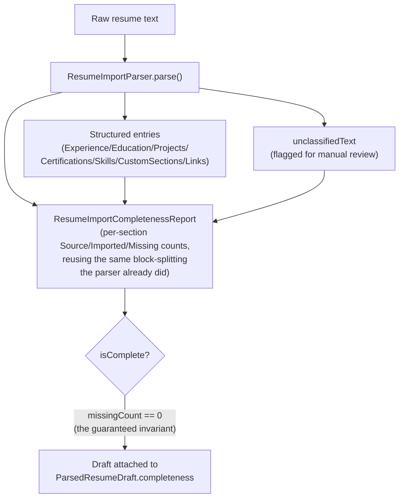

`E` never re-derives "how many entries should exist" independently (which would risk a second, drifting parser) — it reuses `ResumeImportParser`'s own internal block count and confirms every block reached either `C` or `D`, never neither. See D-M8-01, [03-decisions.md](03-decisions.md).

## 10. Resume Creation Entry Points [Built]

Three separate ways to start a resume from `ResumeListScreen` (`lib/features/career/resume/presentation/screens/resume_list_screen.dart`), all converging on the same Editor and export pipeline — no parallel resume architecture anywhere. This diagram exists specifically to show all three side by side, since diagrams 11 and 12 below each drill into one of them individually.

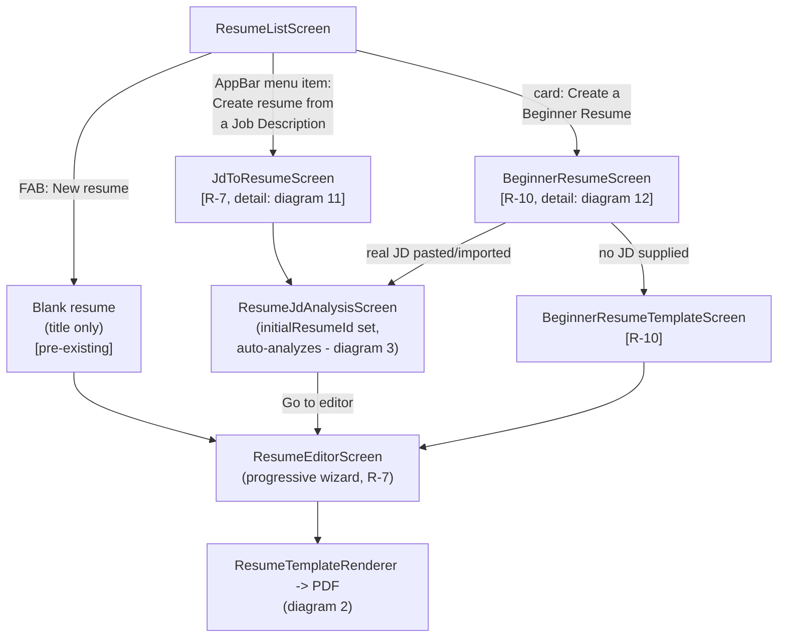

The "existing resume + JD" tailoring flow (pick an already-created resume, then analyze it against a JD) is the same `ResumeJdAnalysisScreen`/diagram-3 pipeline, just entered directly rather than via `initialResumeId` — not a fourth path, the same `Analysis` node above.

## 11. R-7 Additions — Progressive Resume Wizard & "Create Resume from a Job Description" [Built]

**Progressive wizard.** `ResumeEditorScreen`'s `_EditorBody` (`lib/features/career/resume/presentation/screens/resume_editor_screen.dart`) changed from one continuous scroll of all 7 sections to a step-at-a-time wizard (Profile → Experience → Education → Projects → Certifications → Skills → Custom → Review), with a tappable step bar and progress indicator. This is presentation-only: every field, every section widget (`_ProfileCard`/`_ExperienceSection`/etc.), and `ResumeEditorController`'s state/persistence are unchanged — the Review step renders every section together, identical to the old layout, as a final look before saving. No field was removed to make this shorter.

**"Create resume from a Job Description"** (`lib/features/career/jd/presentation/screens/jd_to_resume_screen.dart`, `lib/features/career/jd/create_resume_from_jd_use_case.dart`) is a second, brand-new-resume entry point alongside the pre-existing "pick an existing resume, then analyze it against a JD" flow (§3 above):

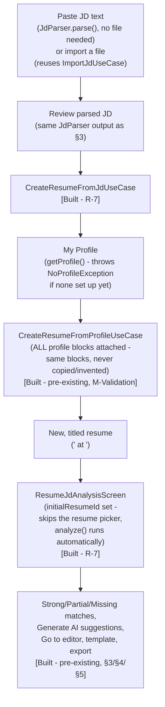

Nothing here is a new resume-creation or JD-parsing mechanism — `CreateResumeFromJdUseCase` is a thin composition of the already-built `CreateResumeFromProfileUseCase` and the already-built `JdParser`. Content is not reordered by JD relevance at creation time (`PrioritizeResumeContentUseCase` needs match evidence that doesn't exist until analysis has run once) — the created resume goes straight into the existing analysis screen instead, which is where a user already sees job requirements vs. their own experience vs. AI-suggested tailoring.

`ResumeJdAnalysisScreen` also gained a small, always-visible header (`_ResumeAndJdHeader`) naming both the resume and the job description together on the results screen, so which resume is being tailored is never only implied by which list item was tapped.

## 12. R-10 Addition — Beginner Resume Flow [Built]

**"Create a Beginner Resume"** (`lib/features/career/resume/presentation/screens/beginner_resume_screen.dart`) is a short, progressive flow for a user with little/no experience or projects (fresh graduates, first-time job seekers) - a clearly visible card on the Resume list screen, the same prominence as "My Profile," not an icon-only popup item.

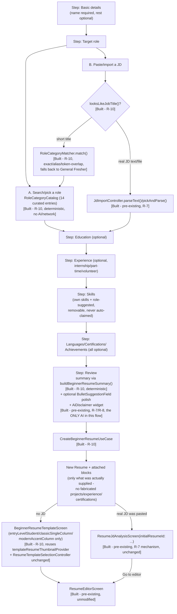

**No parallel resume architecture**: `CreateBeginnerResumeUseCase` writes through the exact same `Resume`/`ResumeBlockRef`/block repositories every other resume-creation path uses (`CreateResumeFromProfileUseCase`, `CreateResumeFromJdUseCase`). The professional summary reuses the existing "Summary" `CustomSectionBlock` convention (`resume_content_plan_builder.dart`'s `isSummarySection`); Languages reuses the same generic `CustomSectionBlock` mechanism the codebase already names "Languages" as an intended use case for. No new database table, model, PDF generator, or rendering path was added.

**No fabrication, by construction**: every block is only created if the corresponding input was actually non-blank (see `CreateBeginnerResumeUseCase`'s own doc comment); `RoleCategory.suggestedSkills` only ever becomes a real `SkillEntry` if the screen's `confirmedSkills` list includes it (a suggestion the user removed is never attached); the generated summary's only role-catalog input is `RoleCategory.summaryFocus` (a phrase describing the *role*, never a claim about the person).

**Offline**: `RoleCategoryCatalog`/`RoleCategoryMatcher`/`looksLikeJobTitle` are static Dart data and pure functions - no network, no AI, no database read. The only AI touchpoint in the entire flow is the Review step's optional `BulletSuggestionField` polish on the summary text, reusing the exact same Tier-2 AI infrastructure `bullet_suggestion_field.dart` already provides elsewhere - the flow completes and produces a full resume with zero AI model installed.
